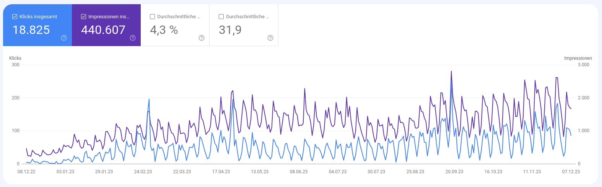
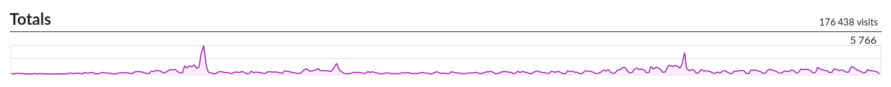

## Was ist die Fachinformatiker Prüfungsvorbereitungs Website?

Zur Vorbereitung auf die Prüfung zum Fachinformatiker Anwendungsentwicklung habe ich mir damals einige Notizen gemacht. Aufgrund des schnellen Erstellens und der Möglichkeiten habe ich diese direkt in Markdown aufgeschrieben.  

Später dachte ich mir das dies Notizen eventuell auch anderen helfen können und habe sie in Form der [Fachinformatiker Prüfungsvorbereitung](https://fachinformatikerpruefungsvorbereitung.de) Open Source zu Verfügung gestellt. Dadurch das die Seite aus einfachem Markdown mit Hugo generiert wird kann nahezu jeder daran mitwirken. Es ist nicht mehr als ein bisschen Markdown-Wissen notwendig.  

Dies haben im letzten Jahr auch schon einige getan. GitHub zählt 11 Contributors wobei das warscheinlich nicht exakt stimmt da hier nur Accounts gezählt werden die noch aktiv sind. (Keine gelöschten Accounts!)

## Contributing

Meiner Rolle für diese Seite ist inzwischen hauptsächlich Instandhaltung und das Managen von Pull Requests. Ich habe meine Prüfung lange hinter mir und möchte meine Zeit gern anderen Projekten intensiver widmen. Nichtsdestotrotz werde ich mich um die Seite kümmern und sie am Laufen halten.  

Deshalb wäre es sehr gut wenn sich Leute finden die den Content weiter verbessern und auch neuen Content erstellen. Wie wir gleich im Stats-Part sehen werden haben wir mit dem Projekt zumindest eine kleine Reichweite und können Menschen helfen.  

Inzwischen habe ich das Projekt auch von meinem Account gelöst und in eine Organisation transferiert. Damit kann es als allgemeines Community-Projekt weiterbetrieben werden ohne das es so wirkt als wäre es **mein** Projekt.

## Stats

In diesem Kapitel möchte ich die Statistiken des letzten Jahres für [Fachinformatiker Prüfungsvorbereitung](https://fachinformatikerpruefungsvorbereitung.de) zeigen. So kann man sich ein Bild für den Einfluss auf die Prüfungsvorbereitung machen.

### Google Suche

In dieser Grafik sehen wir die Stats aus der Google Suche. Die zwei wichtigsten Zahlen werden im Grafen abgebildet. Zum einen die Klicks auf die Website in Blau und zum anderen die Anzahl wie oft jemand in der Google-Suche die Website angezeigt bekommen hat. Letzteres nennt man auch Impressionen. Wir haben also **18.825 Klicks** auf die Seite und **440.607 Impressionen** in den letzten 12 Monaten gehabt. Und das nur in der Google Suche! Diese ist zwar die eindeutig am meisten genutzte Suchmaschine allerdings werden inzwischen immer mehr mit anderen Suchmaschinen gesucht.  

(Die Informationen hier stammen aus der Google Search-Console. Ich benutze **kein Google Analytics** oder andere Privacy missachtende Software!)

### Analytics

Ich nutze ein nicht Privacy invasives Tool namens [GoatCounter](goatcounter.com) zur Gewinnung meiner Analytics Daten. Dieses Tool kann leider deswegen nicht ganz so gute Analytics liefern wie zum Beispiel Google Analytics aber genug Daten hat man auf jeden Fall.

Hier sehen wir zum Beispiel alle Website-Besuche in den letzten 12 Monaten. Diese haben **176.438 Visits** betragen. Wobei man beachten muss das ein Visit für jede Unterseite zählt. Das heist die User sowie die Session Anzahl ist ein gutes Stück unter der Visit Anzahl. Diese können allerdings leider nicht richtig erfasst werden.

### GitHub

Die GitHub Stats sind schwer zu bestimmen da sie im default nur die letzten zwei Wochen wiederspiegeln.  

Sicher kann man sagen das wir zum jetzigen Zeitpunkt **51 Stars** haben. Zudem ist sicher das wir mindestens einige tausend Views von einigen hunderten Accounts hatten.

## Fazit

In den letzten 12 Monaten hat sich die [Fachinformatiker Prüfungsvorbereitung](https://fachinformatikerpruefungsvorbereitung.de) für meine Verhältnisse zu einer Website mit beachtlicher Reichweite aufgebaut. Ich hoffe das sie vielen Leuten auch wirklich nützlich ist und zu einem besseren Prüfungsergebnis beiträgt. Um weiterhin einen solchen Impact zu leisten wäre neuer Content und eine intensive Pflege der Seite von Nutzen. Dafür bräuchte es einige Freiwillige die einander helfen möchten.  

Also wenn du ein bisschen Zeit über hast überleg doch mal ob du die ein oder andere Kleinigkeit [hier](https://github.com/Fachinformatiker-Prufungsvorbereitung/Fachinformatiker-Pruefungsvorbereitung) auf GitHub Beitragen kannst.
