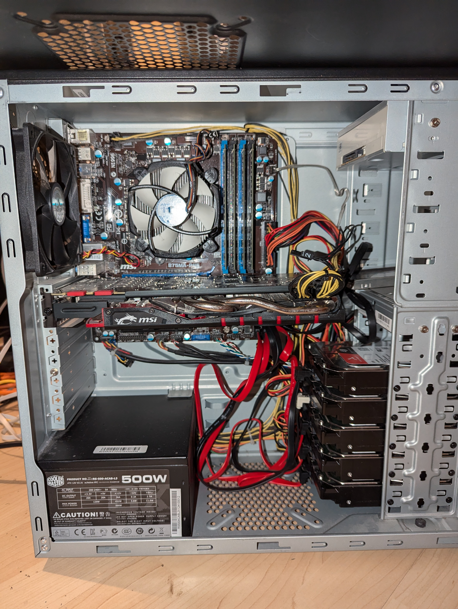

## Hardware

(Looks a bit messy I know 😅 But I somehow like it 😜)

As you can see am I using a old PC as my server. This has the advantage that I only needed to buy the hard drives to support my storage needs but also the downside is that electricity consumption is rather high. Last time I measured with all my apps running it consumed about 60W. A fresh build could be optimized for electricity consumption which can save you a lot of money if you want the server to run 24/7.

I chose to not do a hardware RAID because I am using the ZFS file system. I will explain this in detail in the software part.

### ECC memory?

I sadly do not have ECC RAM but if you can get one I would recommend it. Error correction code RAM is able to correct wrong bits which makes the system more secure against some hardware attacks and especially more reliable. It is no complete dealbreaker not having it (especially because its kind of rare in the consumer world in the moment) but having it is a nice addon.

### Uninterrupted power supply (UPS)

I bought a UPS to support my server in case of electricity outages. The UPS has a battery which can keep my server at life for about 15 minutes than it gives a signal to the server which is configured to shut down before the battery of the UPS runs out. This makes sure that first of all most of the electricity outages never make a problem at all because they are shorter than the battery time and secondly that if the power is gone for a while the server shuts itself down gracefully.

### Full specs

CPU: TODO  
RAM: 32 GB TODO  
HDD: TODO  
SSD: TODO  
GPU: NVIDIA GTX 970  

## Why I chose TrueNAS Scale

Now to the in my opinion most important part the operating system. I chose TrueNAS Scale for a couple of reasons. First of all I wanted to have something that is Open Source. I also need to run apps on the system and definetly need some sort of RAID / software RAID. TrueNAS Scale has it all. It is based on Linux and lead by the company iXsystems. For applications it supports Docker and Kubernetes as well as own VMs. I am actually not really using the VMs yet but I really like Kubernetes and also Docker. So this was great news for me. These technologies allow you basically to run every app you like on it because most of the apps are or can be containerized. In addition to this the system uses OpenZFS as file system which is pretty cool in my opinion. We will take a look at it in the next part.

### RAID and ZFS

### Setup of the software

### How I move files  

## What apps do I run

### TrueCharts and why I do not use them anymore

### NPM Reverse proxy and setup

### Nextcloud

### Home Assistant

### Jellyfin

### What else could you run