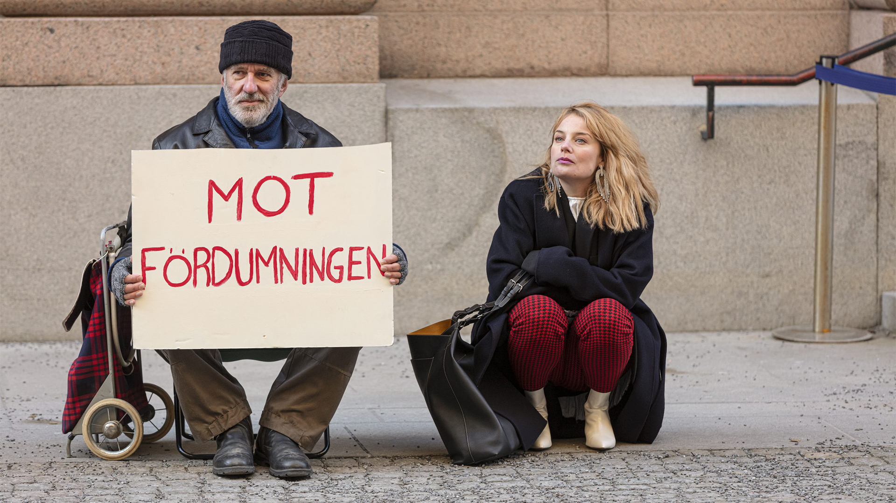
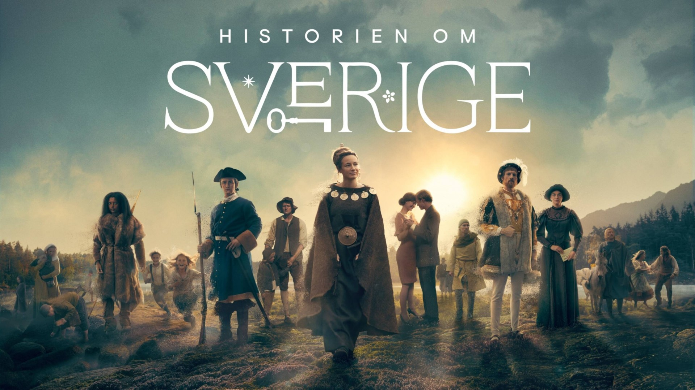
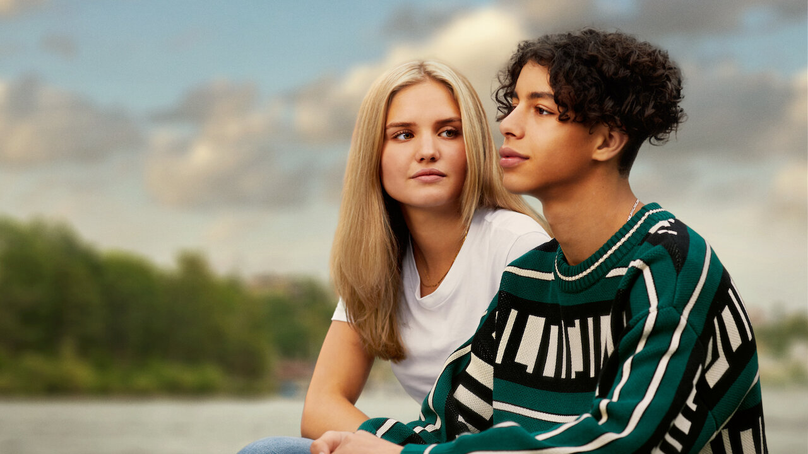
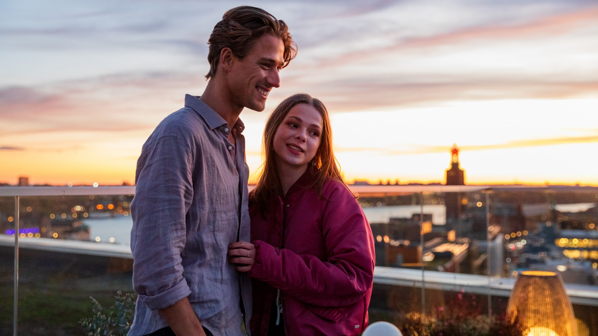

Jag lär mig svenska själv sedan cirka tio månader. Jag började titta på filmer och serier tidigare i år. I det här inlägget vill jag berätta om vad jag har tittat på, vad det handlade om och om jag tyckte om det. (Det här är inte allt jag har sett, men det är det jag tänker är intressant.)

Eftersom det inte finns många serier och filmer som är översatta till svenska, är alla av dem svenska produktioner.

> Jag ska försöka berätta utan att spoila filmen eller serien. Men det kan bli mindre spoilers. Så var varnad!

## Barracuda Queens

Barracuda Queens utspelar sig år 1995 och är namnet på ett tjejgäng. Det handlar om fem tjejer. De är vänner och behöver pengar av olika skäl. De bryter in hos rika människor, några av dem de känner. Det utspelar sig i Djursholm nära Stockholm, som är en av de rikaste områdena i Sverige. De jagas av polisen och måste se upp för varandra så att de inte hamnar i fängelse.

Jag måste säga att jag gillade serien. Det är en riktigt bra brottsserie på ett gammaldags sätt. Jag har tittat på den två gånger och jag är fascinerad av hur man kan märka att man blir bättre varje gång. Första gången förstod jag bara två tredjedelar, men nu några månader senare är det mycket bättre och jag förstår nästan allt. Jag skulle säga 80% till 90%.

Du kan titta på denna serie på Netflix. Den består av sex avsnitt.

## Kärlek & anarki

Kärlek & anarki utspelar sig i det moderna Stockholm. Det handlar om den unga IT-teknikern Max och en gift kvinna, Sofie, som är expert på framtidsutveckling och mor till två barn. I början är hon en riktig affärskvinna. De möts på jobbet på ett förlag. Serien handlar om deras svåra förhållande och deras utmanande flirtspel.

Genren är både komedi och drama, men jag tycker att även om situationerna är roliga, är serien i grunden seriös. Jag gillar verkligen att hon har en "anarkistisk" sida och växlar mellan att vara seriös och rolig. Jag tänker att man kan se hur hon hittar mer och mer av sitt sanna jag och frigör sig från sitt vanliga liv för att göra vad hon verkligen vill.

Det finns två säsonger med åtta avsnitt vardera på Netflix.

## Historien om Sverige

Historien om Sverige är en dokumentärserie som handlar om hela Sveriges historia, från de första människorna till vikingatiden och fram till idag. Närmare bestämt handlar det om stenåldern, metallernas tid, vikingarnas tid, hur kristendomen kom till Sverige, kampen om tronen, stormakten Sverige, häxor och fler krig, de nya tiderna, demokratiseringen och slutligen idag, då SVT säger att Sverige är det modernaste landet i världen.

Jag tyckte verkligen om hela serien men jag har favoritepisoder. Jag särskilt gillade de sista tre episoderna eftersom de handlar om hur Sverige har blivit ett modernt land med en riktigt bra demokrati, välfärdssystem och frihet i allmänhet. Men de andra episoderna är också riktigt bra. Till exempel gillade jag verkligen stormakten Sverige. Hela serien har bra kvalitet och är rolig att titta på.

Denna serie var den första jag tittade på på svenska så jag förstod inte allt. Men jag förstod ändå en del. Jag tänker att det kan vara bra att titta på den igen i framtiden.

Det finns tio episoder på [SVT](https://www.svtplay.se/historien-om-sverige), Sveriges Television i allmänhetens tjänst. Jag kan verkligen rekommendera SVT eftersom de har mycket gratis innehåll och jag tycker att det är av riktigt god kvalitet. Ett tips för att titta på SVT från utanför Sverige är att använda en VPN-tjänst så man kan låtsas vara i Sverige.

## Vinterviken

Det är den första filmen på denna lista. Vinterviken utspelar sig i moderna Stockholm igen. Det handlar om en kille som heter John John (JJ) och en tjej som heter Elisabeth. JJ är av arabiskt ursprung och lever i en fattig del av Stockholm. Elisabeth däremot är dotter till en rik svensk familj. En dag räddar John John Elisabeths syster från att drunkna, så de möts efter det. Filmen är berättelsen om deras kärlek och förhållande, vilket är svårt på grund av omständigheterna. Till exempel är brott vanligt i JJs dagliga liv även om han är en fin kille.

Jag gillade filmen men inte lika mycket som de andra på listan. Det var en lugn film tycker jag men det är inget problem. Jag tänker att målgruppen för filmen är ungdomar, så det kan förklara det.

Du kan titta på filmen på Netflix.

## En helt vanlig familj

En helt vanlig familj är en kort brottserie. Den här gången utspelar sig serien i Lund, en liten stad nära Malmö. Det handlar om en tjej som blev våldtagen när hon var yngre. Nu träffar hon en äldre kille som är rik. De går på några dejter men det är något konstigt med honom.

Det var roligt att titta på serien, men jag gillade de första tre serierna på listan mer än denna. Men jag njöt av serien och det var bra att se lite av Lund, Malmö och Köpenhamn. Om du tycker om brottserier med mord, våldtäkt och andra mörka teman kommer du att gilla den här.

Det finns sex episoder på Netflix.