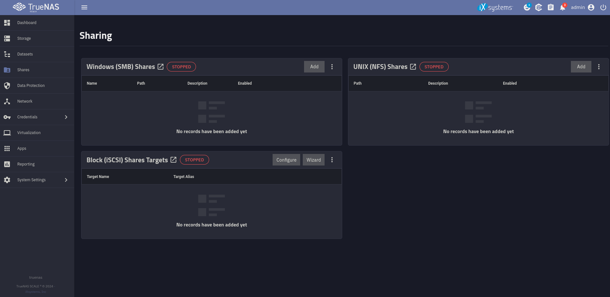
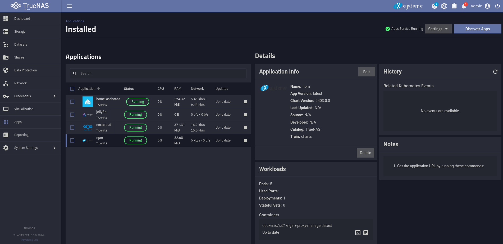
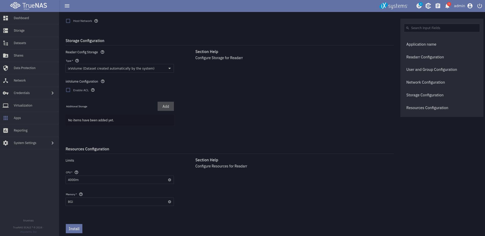

## Hardware

(Looks a bit messy I know 😅 But I somehow like it 😜)

As you can see am I using a old PC as my server. This has the advantage that I only needed to buy the hard drives to support my storage needs but also the downside is that electricity consumption is rather high. Last time I measured with all my apps running it consumed about 60W. A fresh build could be optimized for electricity consumption which can save you a lot of money if you want the server to run 24/7.

I chose to not do a hardware RAID because I am using the ZFS file system. I will explain this in detail in the software part.

### ECC memory?

I sadly do not have ECC RAM but if you can get one I would recommend it. Error correction code RAM is able to correct wrong bits which makes the system more secure against some hardware attacks and especially more reliable. It is no complete dealbreaker not having it (especially because its kind of rare in the consumer world in the moment) but having it is a nice addon.

### Uninterrupted power supply (UPS)

I bought a UPS to support my server in case of electricity outages. The UPS has a battery which can keep my server alive for about 15 minutes than it gives a signal to the server which is configured to shut down before the battery of the UPS runs out. This makes sure that first of all most of the electricity outages never make a problem at all because they are shorter than the battery time and secondly that if the power is gone for a while the server shuts itself down gracefully.

### Full specs

CPU: TODO  
RAM: 32 GB TODO  
HDD: TODO  
SSD: TODO  
GPU: NVIDIA GTX 970

## Why I chose TrueNAS Scale

Now to the in my opinion most important part the operating system. I chose TrueNAS Scale for a couple of reasons. First of all I wanted to have something that is Open Source. I also need to run apps on the system and definetly need some sort of RAID / software RAID. TrueNAS Scale has it all. It is based on Linux and lead by the company iXsystems. For applications it supports Docker and Kubernetes as well as own VMs. I am actually not really using the VMs yet but I really like Kubernetes and also Docker. So this was great news for me. These technologies allow you basically to run every app you like on it because most of the apps are or can be containerized. In addition to this the system uses OpenZFS as file system which is pretty cool in my opinion. We will take a look at it in the next part.

### RAID

As I previously said I am not using a classical RAID system. The file system ZFS which is used by TrueNas Scale has something similar to a software RAID build into it.

But first of all to bring everyone on the same level I want to explain what RAID actually is. RAID stands for redundant array of independent disks and as the name suggests brings redundancy into data storage. There are several versions of RAID (0, 1, 5, 6 are the most important ones). RAID 0 just stripes the data across multiple disks and does not provide and redundancy. RAID 1 mirrors every disk on another one so half of the disks could fail without lousing any data. The last two versions are the important ones for this blog post. They both work similar: First of all does the data get striped like in RAID 0 but there also gets calculated a parity part which can be used to calculate the data if a drive fails. With RAID 5 you can loose one disk without loosing data and with RAID 6 you can loose two whole disks without an issue.

### OpenZFS

Now lets talk about ZFS which is a awesome file system in my opinion. It provides a set of features which makes it especially interesting for server operation and for other systems where correct data storage is important. A few of its features are RAID-Z which I talk about later more, data compression, data deduplication, snapshots and self healing. All of this features are very interesting for building storage focused server like I am.

Now lets talk a bit about RAID-Z as this is the most important feature. This feature allows me to run the server without a physical RAID controller. It works a bit different as RAID which gives it better performance and also has the self healing ability ZFS is known for all while not needing a RAID controller anymore. This is actually only possible because there is no RAID controller and the file system can manage the disks directly. It is not recommended to use ZFS in addition to a hardware RAID.

### Setup of the OS

The installation of the OS is pretty straightforward you can follow the [installation guide](https://www.truenas.com/docs/scale/24.04/gettingstarted/install/installingscale/) on the developers website.

If you set everything up this how the web ui looks like. Here you can control pretty much everything about the system graphically. In addition to the ui I would recommend you to setup a SSH connection so you can use the command line on your system. You can do that under `credentials => users => upload SSH key`

Under datasets you can setup different folders with different permissions, purposes, shares and much more. You can decide if you want to encrypt your data (you want to) and how you want to do it. There are two options. With the simplest option a key gets generated and you just have to safe it somewhere safe as backup while the server stores it securely. But if you are like me and a bit paranoid when it comes to disk encryption you can also use a really strong password. The difference is that you have to enter this password after every restart. This provides the security that if your system is shutdown it is safe against a lot of hardware attacks.

### How I move files

TrueNas Scale provides you with a few kinds of file shares. I tried them all but did not really like any of them. Which actually makes it a lot simpler for me. I am using SSH in my Gnome file explorer if I want to move files or I just do it over the command line. This works perfectly fine for me.

If you want to use shares you are able to use SMB, NFS and iSCSI to do so. Just play around with it and see what you like most. For me its the good old SSH.

## What apps I run

Now to the most interesting part in my opinion. This is why I do all this. I want to run apps which support me in my day to day life and provide value.

### TrueCharts and why I do not use them anymore

But we need to talk about TrueCharts first. They are a pretty big third party app cataloge or at least they were for a very long time. They now said that they are going to drop support for TrueNas Scale because they say iXsystems will remove Kubernetes out of the OS in a future update. I am not really sure about that because I did not read something big. But I think sticking with the original apps is not that bad either way. Its a bit differnt to setup but I will guide you threw it here.

I also want to mention that I had a few problems using Charts from TrueCharts. I do not want to blame them for it but I think they are less stable than the original ones. But they have also advantages like more settings and less performance overhead so I think the guys from TrueCharts still did a relly good job.

### Install a app

I do not want to use file shares for everything. That is not very convenient. I want to use an app that works like all the other file cloud provider. This is why I host Nextcloud on my NAS. This is a really cool private cloud software which manages everything like files, contacts, calender and the list goes on and one and one. I will talk a bit more in a future post about it. But for now lets take a look at how to install it.

The process actually is pretty simple. You can just choose your app from the catalog which you can open with the discover button.

Here you can choose from many different apps or provide your own if you want to create something not in the default apps. If you have found a app you want to install you can click on it and configure the app with everything the app allows you to change. Here are the TrueCharts apps better because you can configure way more. But the default apps have a few settings as well and are much simpler. A important thing to keep in mind is that there is a limitation with the default apps so you can not use ports below 9000.

If you are finished with configuring it is just as easy as pressing the install button. After a few minutes the app is running and you can access it over the port you chose.
