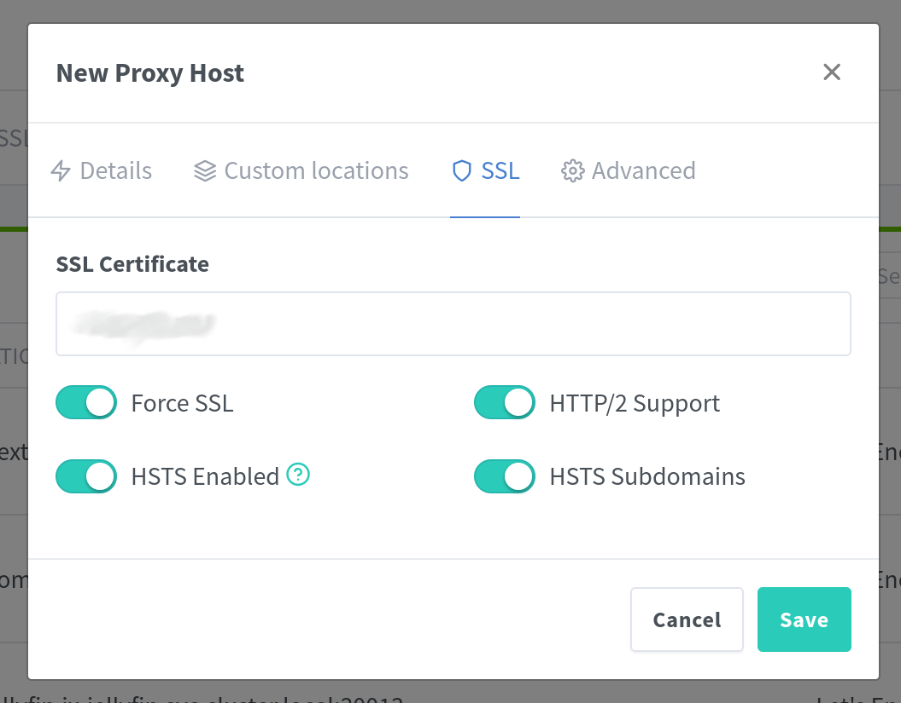

This is the third post in a [larger series](../../../tags/home-server-project/) about self-hosting with TrueNAS Scale. In this post, I want to show you how to set up the Nginx reverse proxy without relying on TrueCharts. I explained in [the last post](../truenas-scale/) why I am moving away from them. In short: Support will be dropped.

## Nginx Proxy Manager

Using the default charts in TrueNAS Scale, your application can only be exposed on a high port. Accessing your apps via such a weird port and without a proper domain isn't cutting it. Is it? Therefore you can run a reverse proxy that manages TLS encryption and directs traffic for each subdomain to its respective app, without needing a special port in the URL.

Until now, I had always used a Traefik proxy when working with Kubernetes, but I found this cool project that seemed to fit perfectly. It's called Nginx Proxy Manager, or NPM for short. With NPM, you can set up a reverse proxy and also manage your TLS certificates using Let's Encrypt.

## Installation

First of all, we can't install this app the way we would normally install an app. It is in the default app catalog, but this version can only be hosted on port 9000. Instead, we’ll use the Docker image to deploy it. This won’t make any difference, but we can use our own IP address for it, which also means we can use all ports.

To start, go to the app catalog and click `Custom APP` in the top right corner. There, you can configure everything. I’ll provide the required settings below.

| Configuration Name | Value                                                                                                 |
| ------------------ | ----------------------------------------------------------------------------------------------------- |
| Image Repository   | `jc21/nginx-proxy-manager`                                                                             |
| Image Tag          | `latest`                                                                                               |
| External Interface | Choose your interface and use an IP address that is not used by any device, including your server [^1]. |
| DNS Policy         | Prioritize Kubernetes DNS [^2].                                                                        |
| Storage            | Set up two storage paths one for `/etc/letsencrypt` and one for `/data`. I recommend using Host Path Volumes. |

After installing the app, you can access it via its IP address on port `81`. The default username is `admin@example.com`and the password is `changeme`. Change them immediately!

## Setting Up TLS

Once everything is set up and you’ve changed your password, you’ll see something like this. First of all, I recommend setting up your TLS certificate if you have a domain. If you don’t have a domain, you can still upload a custom certificate.

Click on the `SSL Certificates` tab to see a list of all the certificates you’ve set up. If you click the button in the top right, you can create a new certificate. Here, you can choose between the Let's Encrypt certificate authority or upload a custom certificate if you're using a local domain. But if you can get a domain, I recommend doing so. I will proceed with the setup instructions for Let's Encrypt.

If your server is reachable from the public internet, you just need to enter your domain name and agree to the Terms of Service. This will spin up a local webpage to verify that you actually own the domain you enter.

> You can also set up a TLS certificate for all subdomains by entering `*.example.com`.

If your server is not accessible from the public or if you want to use another method, you can choose the DNS challenge. NPM has a couple of DNS providers which you can choose from. Take a look at the list and search for your DNS provider.

You just have to enter the API token or log in another way specific to your provider. NPM will then modify the DNS records to prove that you own the domain you have provided.

If you complete any of these methods successfully, you'll get your SSL certificate.

## Setting Up Your Apps

Now we want to configure the Nginx Proxy Manager to relay traffic from specific domains to a specific TrueNAS Scale app. To do this, go to `Dashboard => Proxy Hosts`.

Here, you’ll see an overview of all the hosts / apps you’ve configured. On the top right, you can add a new host.

In this window, you can finally configure access to your app. You need to enter the domain where you want your app to be available, choose the scheme (http/https) your app runs on (probably http)and enter the port your application uses.

The hostname of your app is its internal DNS entry in the Kubernetes cluster. It usually follows this pattern: `<app-name>.ix-<app-name>.svc.cluster.local`. So, for Jellyfin, it would be: `jellyfin.ix-jellyfin.svc.cluster.local`.

You can find the correct port in the app's configuration or use the default port.

> **These are the values for your app running in TrueNAS Scale, not the values for accessing the app publicly!**

I also recommend enabling `Websocket Support` and `Block Common Exploits`.

At this point, your app will be accessible via your domain, but one final step is needed to allow requests over HTTPS. You just have to go to the SSL tab and select the certificate we set up earlier.

After selecting your certificate, I recommend enabling all the available options (`Force SSL`, `HTTP/2 Support`, `HSTS Enabled`, `HSTS Subdomains`).

Once you click save, the host is set upand your app should be accessible via your domain and the HTTPS protocol.

> If you want to point one domain to your Nginx Proxy Manager UI, you can just point it to `http://localhost:81`.

## Footnotes

[^1]: It took me a while to figure this out because my app only worked sometimes on certain devices. I had registered the IP under the server's networking, which caused some devices to work intermittently. Why it worked at all, I can’t say, but just don’t do it.  
[^2]: This is needed if you want to use the internal Kubernetes DNS entries to refer to your apps.
