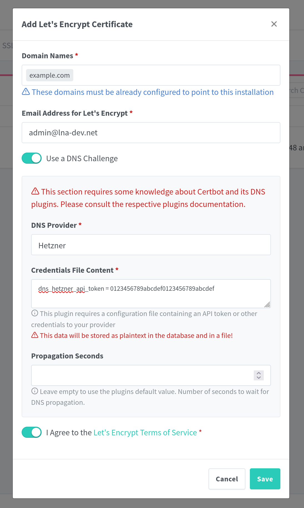

### Nginx proxy manager

Accessing your apps by such a weird port and without a proper domain isn't cutting it. Is it? Therfore I also have a reverse proxy running which manages TLS encryption and sends traffic for each subdomain to its own app without having a special port in the URL. In this part I want to show you how you can set this up to.

Until now I always used an Traefik proxy when working with Kubernetes but I found this cool project which seemed to fit in here perfectly. It is called Nginx proxy manager or short NPM. With NPM you can setup a reverse proxy and also manage your TLS certificates by using LetsEncrypt.

#### Install

First of all we can not install this app how we would normaly install a app. It is in the default app catalouge but this version only can be hosted on port 9000. What we will do instead is use the Docker image and deploy that. This will not make any difference but we can use our own IP for it. Which also means we can use all ports.

So to start go to the app catalog and press `Custom APP` in the top right corner. There you can setup everything. I will provide the required configuration below.

| Configuration name | Value                                                                                                                          |
| ------------------ | ------------------------------------------------------------------------------------------------------------------------------ |
| Image repository   | `jc21/nginx-proxy-manager`                                                                                                     |
| Image tag          | `latest`                                                                                                                       |
| External interface | Choose your interface and use an IP address which is not used by any device including your server. [^1]                        |
| DNS policy         | Prioritize Kubernetes DNS [^2]                                                                                                 |
| Storage            | Here you have to setup two storages. One for `/etc/letsencrypt` and one for `/data`. I would recommend using Host Path Volumes |

After installing the app you can access it on its ip address on port `81` and the username is `admin@example.com` while the password is `changeme`. Change them immediately!

#### Setup TLS

If you set everything up and changed your password you will see something like this. First of all I would recommend setting up your TLS certificate if you have a domain. If you do not have a domain you can still upload a custom certificate.

If you click on the `SSL Certificates` tab you can see a list of all the certificates you have set up. If you click on the button on the top right you can create a new certificate. Here you can choose between the Let's Encrypt certificate authority or upload a custom certificate if you want to use a local only domain. But if you can get a domain I would reccomend you to. I will proceede with the setup instructions for Let's Encrypt.

If your server is reachable from the public internet you only have to fill in your domain name and agree to the Terms of Service. This will spin up a local webpage which will verify that you actually own the domain you enter here.

> You can also setup a TLS certificate for all subdomains if you enter `*.example.com`

If your server is not accesible from the public or you want to use another method for another reason you also can choose to do a DNS challenge. NPM has a couple of DNS providers which you can choose from. Take a look at the list and search for your DNS provider.

You just have to enter the api token or login another way specific to your provider. NPM will than modify the DNS records to prove that you own the domain you have provided.

If you did one of this ways successfully than you will get you SSL certificate.

#### Setup your apps

Now we want to configure the Nginx proxy manager to relay the traffic of specific domains to a specific TrueNas Scale app. To do this we have to enter `Dashboard => Proxy Hosts`.

Here you have again a overview page. This time for all the hosts / apps you already have configured. On the top right side you can add a new host.

In this window you can now finally configure access to your app. You have to enter the domain you want your app to be available under enter the scheme (http / https) which your app runs (probably http) and enter the port of your application.

The hostname of your app is the internal DNS entry of your app in the Kubernetes cluster. It usually follows this pattern: `<app-name>.ix-<app-name>.svc.cluster.local`. So for Jellyfin it would be: `jellyfin.ix-jellyfin.svc.cluster.local`.

The right port you can find in the configuration of the specific app or you can try the default port.

> **This are the values of your app running in TrueNas Scale not the values you want for accessing the app publicly!**

I also would recommend to turn on `Websocket Support` and `Block Common Exploits`.

For now your app would be accesible over your domain but one final step is missing to allow request over HTTPS. You just have to go to the SSL tab and select the certificate we set up earlier.

After selecting your certificate I would recommend you to turn on all the options available. (`Force SSL`, `HTTP/2 Support`, `HSTS Enabled`, `HSTS Subdomains`)

If you press save now the host is set up and your app should be accessable over your domain and the HTTPS protocol.

> If you want to point one domain to your Nginx proxy manager UI you can just point it to `http://localhost:81`.

## Footnotes

[^1]: Took a while until I found out because of what my app only worked sometimes on some devices. I had the IP registred under networking on my server which caused some devices to work only some of the time. Why this did work at all I can not tell but just don't do it.
[^2]: This is needed if you want to use the internal Kubernetes DNS entries to refer to your apps.
