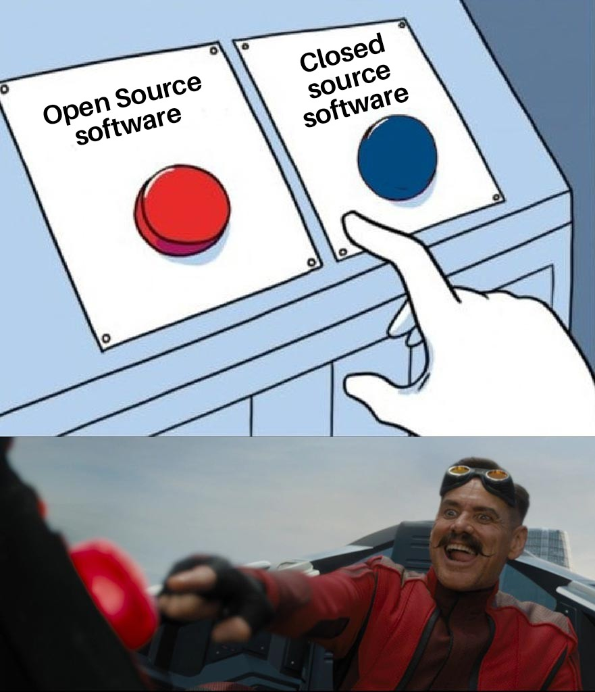
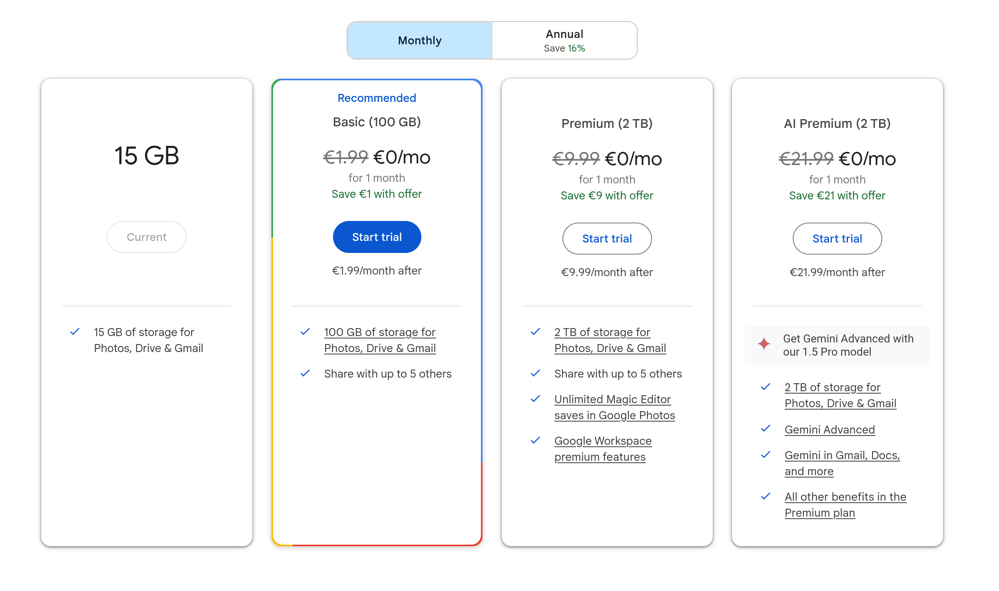

First of all this is the first post of a bigger series of blog post I will dedicate to building my home server. You can find all of them under the tag [Home-Server Project](../../../tags/home-server-project/).

There are many reasons someone would want to have a home server. In this post I want to explain why I chose to build a home server and in the following ones I will show you how I did it and how you can do it too.

## Privacy and independence

For me there are few main reasons why I wanted to get started with selfhosting. I think my journey began about two years ago in 2022 when I first was playing around with a Synology NAS. This helped me a bit with some of the goals I have. Having a Synology NAS improved my independency especially from big tech and other nightmares and therefore also improved my privacy. But after a while I had a feeling that something wasn't quite right with this setup. First the Synology software is not **Open Source** and therefore there are still **privacy** concerns. Also Synology is a taiwanese company and the situation with China was warring me therefore. (There would be a lot of bigger problems in tech but it was still warring me.)

So the next step was building my own NAS / home server with custom **Open Source** software. I explain this more in depth later in the post. For now just say I build my own server about a year ago in 2023 and now have all my data at home in a environment I trust and am able to control fully. So I achieved a lot of independence of the shady big tech companies.

## Cost

Cost can be advantage or disadvantage if you start to selfhost. On the one side you have to pay for your hardware and electricity your server consumes but on the other side you can cancel a couple of subscriptions which are also pretty expensive. For example are you probably using some sort of cloud storage. (Or at least you should be using something like that in my opinion. [^shouldHaveCloudService] ) 

Having a bit of data in such a storage can have high costs. For example buying OneDrive which is included in the MS Personal subscription costs about $6.99 a month.[^oneDrivePrice] This price only includes 1TB if you have big amounts of data this can get very expensive. To take a look at another example: Googles cloud storage costs 9.99€ a month for 2TB.[^googleDrivePrice] Other cloud storages like a hosted Nextcloud might even be more expensive.

You also have to keep in mind this are only costs for one service. On your service you can host a couple of services you need and even share those and also the costs.

Because all of this you save a bug in my opinion if you start selfhosting and replacing the services you pay for with your own server. But this can vary from person to person.

> Just to mention it: OneDrive and a lot of other big tech tools scan your files for illegal content and use filters that might report you to law enforcement. This tools are known to make mistakes and so a image of your child on the beach can lead to your Microsoft account being suspended in the best case and a meeting with the local police in the worst case. Something like that will never happen if you are selfhosting. Be aware!

## Knowledge

Another good point for having a home lab is all the knowledge you get from it. You have to think about the hardware set everything up physically, you need to learn about RAID, about the operating systems and the software you are running, not to mention security and setting up a safe environment. There is a lot to learn on this journey!

And the good thing here is this is not a one time thing. You can learn a lot as the time moves on. Every now and than if you feel motivated you can play around with some settings or try something new.

This knowledge can also payback in your job as you gain experience you maybe wouldn't have otherwise. Personally speaking I learned most of the things I know about IT and especially programming and DevOps while building my own things. It is just way more motivating building the things you want than just learning by doing exercises you do not care about.

## Helping others

Last but not least I want to mention a small point I think is notable. If you are building all of this for you it is really easy to give a few other people access to the services you are running. So you can help out your friends and family to have a better privacy and generally speaking all of the benefits I was talking about. [^liabilityFriends]

## Footnotes

[^shouldHaveCloudService]: Of course you should not use services that are not end to end encrypted or run by one of the big tech companies. But a service like that provides great value. Especially if you selfhost it!
[^oneDrivePrice]: Data from <https://www.microsoft.com/en-us/microsoft-365/onedrive/compare-onedrive-plans> retrieved on July 24.
[^googleDrivePrice]: Data from <https://one.google.com/about/plans?g1_landing_page=0&hl=en> retrieved on July 24.
[^liabilityFriends]: But be careful with that because you gain a lot of power if you do that because you may get access to sensitive information. So keep in mind: With great power comes great responsibility^^
