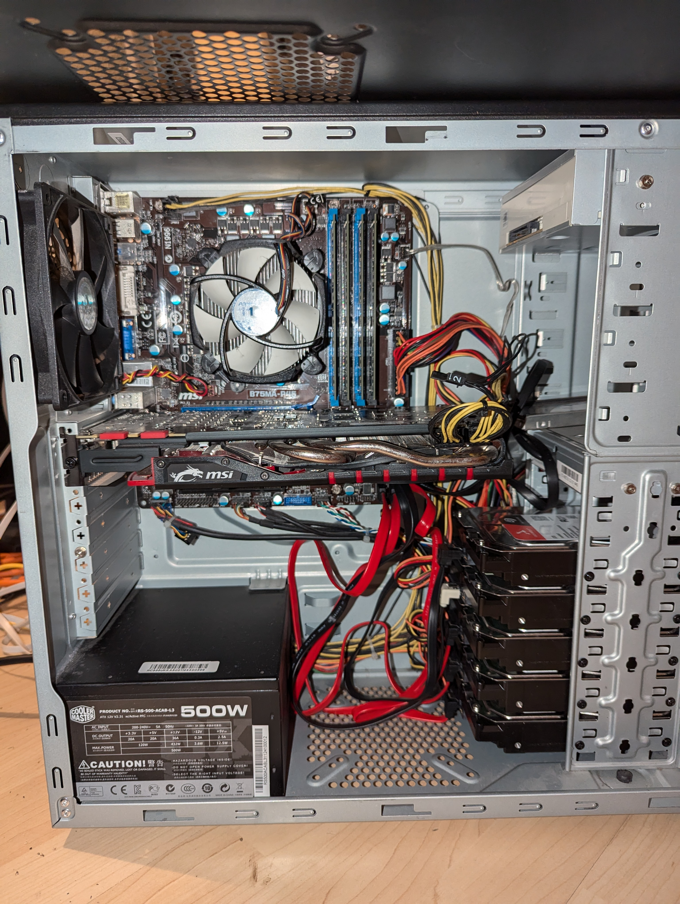
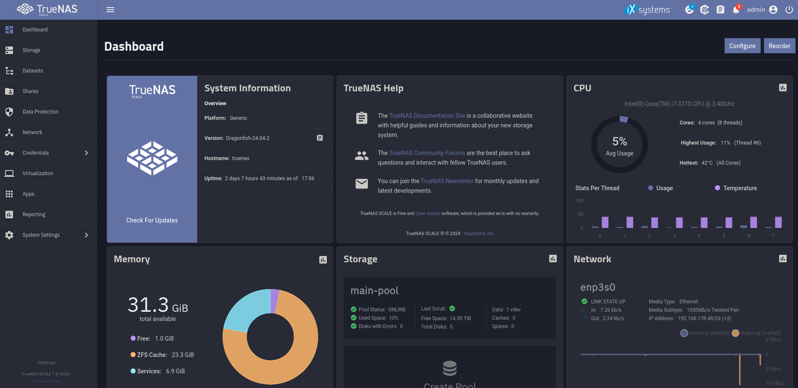
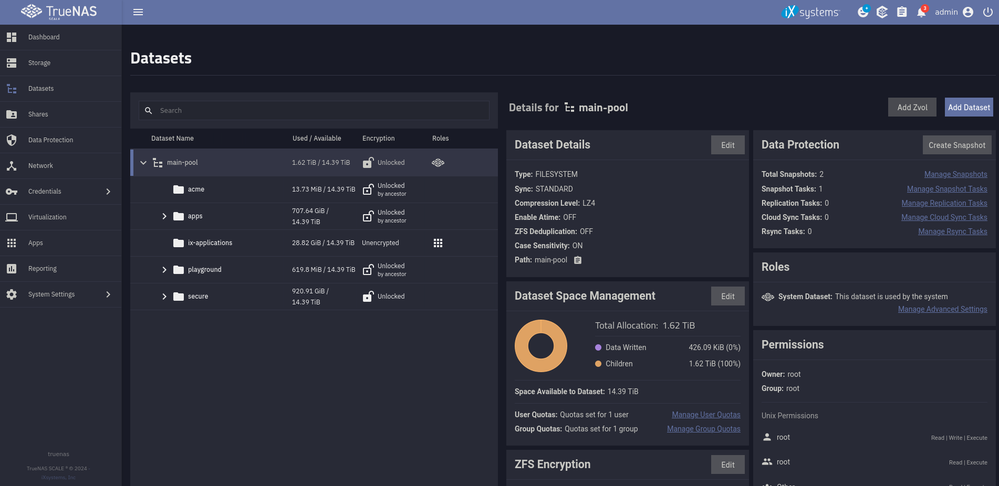
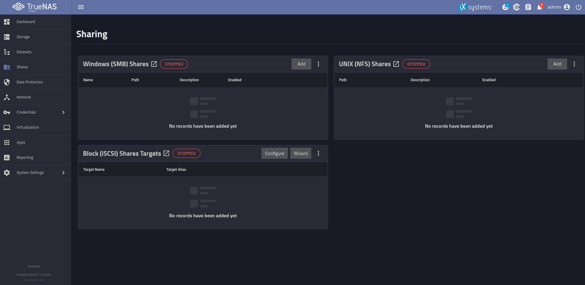
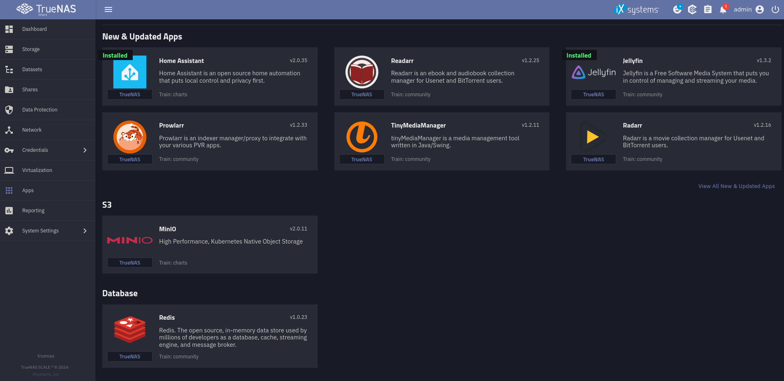
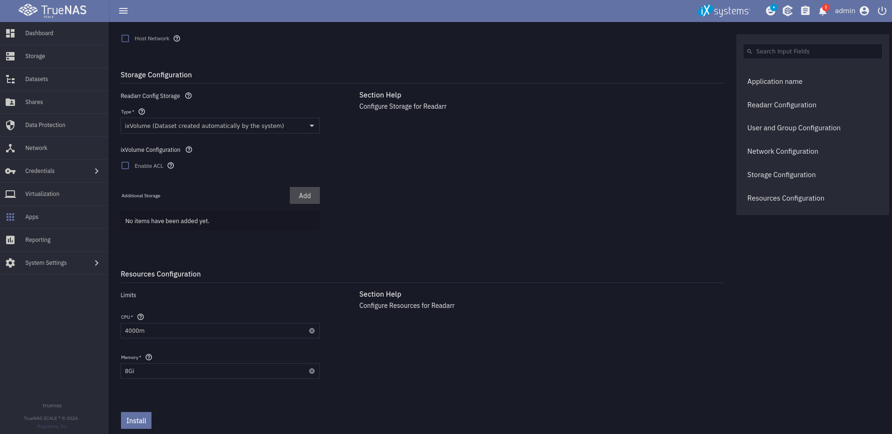

This post is part two of a bigger series of blog posts about my home server and how you can make your own. In [the first post](../advantages-of-a-home-server/), I describe why I wanted to have a home server and the next one will be about how to set up the Nginx Proxy Manager (NPM) without TrueCharts. You can find all posts under the [Home-Server Project](../../../tags/home-server-project/) tag.

## Hardware

(Looks a bit messy, I know 😅 But I somehow like it 😜)

As you can see, I am using an old PC as my server. This has the advantage that I only needed to buy the hard drives to support my storage needs, but the downside is that electricity consumption is rather high. Last time I measured, with all my apps running, it consumed about 60W. A fresh build could be optimized for electricity consumption, which can save you a lot of money if you want the server to run 24/7. [^alwaysRunning]

I chose not to do a hardware RAID because I am using the ZFS file system. I will explain this in detail in [a dedicated part](#openzfs).

### ECC memory?

I unfortunately do not have ECC RAM, but if you can get it, I would recommend it. Error Correction Code (ECC) RAM is able to correct wrong bits, which makes the system more secure against some hardware attacks and especially more reliable. It is not a complete dealbreaker not having it, (especially because it's kind of rare in the consumer world at the moment) but having it is a nice addon.

### Uninterrupted Power Supply (UPS)

I bought a UPS to support my server in case of power outages. The UPS has a battery that can keep my server alive for about 15 minutes, then it gives a signal to the server, which is configured to shut down before the UPS battery runs out. This ensures that most power outages never cause a problem, as they are shorter than the battery time and if the power is out for a while, the server shuts down gracefully.

<!-- TODO Add those? -->
<!-- ### Full specs

CPU: TODO  
RAM: 32 GB TODO  
HDD: 6 x   
SSD: TODO  
GPU: NVIDIA GTX 970 -->

## Why I chose TrueNAS Scale

Now to, in my opinion, the most important part: the operating system. I chose TrueNAS Scale for a couple of reasons. First of all, I wanted something that is **Open Source**. I also wanted to run apps on the system and definitely needed some sort of RAID / software RAID. TrueNAS Scale has it all. It is based on Linux and led by the company [iXsystems](https://www.ixsystems.com/). [^iXsystems] For applications, it supports Docker and Kubernetes, as well as its own VMs. I am actually not really using the VMs yet, but I really like Kubernetes and also Docker. So this was great news for me. These technologies allow you to run basically any app you like on it because most apps are or can be containerized. In addition to this, the system uses OpenZFS as the file system, which is pretty cool in my opinion. We will take a look at it in the next part.

### RAID

As I previously mentioned, I am not using a classical RAID system. Instead the ZFS file system, which is used by TrueNAS Scale, has something similar to a software RAID built into it.

But first of all, to bring everyone on the same level, I want to explain what RAID actually is. RAID stands for Redundant Array of Independent Disks and as the name suggests brings redundancy into data storage. There are several versions of RAID (0, 1, 5, 6 are the most important ones). RAID 0 just stripes the data across multiple disks and does not provide any redundancy. RAID 1 mirrors every disk on another one so half of the disks could fail without losing any data. The last two versions are the important ones for this blog post. They both work similarly: First, the data gets striped like in RAID 0, but a parity part is also calculated, which can be used to recover the data if a drive fails. With RAID 5 you can lose one disk without losing data and with RAID 6 you can lose two disks without an issue. The disadvantage of RAID is that you need more disks because of the redundancy.

### OpenZFS

Now let's talk about ZFS, which is an awesome file system in my opinion. It provides a set of features that make it especially interesting for server operation and other systems where correct data storage is important. A few of its features are RAID-Z (which I'll discuss later), data compression, data deduplication, snapshots and self-healing. All of these features are very interesting for building a storage-focused server like the one I am building.

RAID-Z is the most important feature of ZFS in my opinion. It allows me to run the server without a physical RAID controller. It works a bit differently from RAID, which brings better performance and it also has the self-healing ability ZFS is known for, all while not needing a physical RAID controller anymore. This is actually only possible because there is no RAID controller and the file system can manage the disks directly. It is not recommended to use ZFS in addition to a hardware RAID because of that.

### Setup of the OS

The installation of the OS is pretty straightforward. You can follow the [installation guide](https://www.truenas.com/docs/scale/24.04/gettingstarted/install/installingscale/) on the developer's website.

If you set everything up, this is how the web UI looks. Here you can control pretty much everything about the system graphically. In addition to the UI, I would recommend setting up an SSH connection so you can use the command line on your system. You can do that under `credentials => users => upload SSH key`.

Under datasets you can set up different folders with different permissions, purposes, shares and much more. You can decide if you want to encrypt your data (you want to 😉) and how you want to do it. There are two options. With the simplest option, a key gets generated and you just have to save it somewhere safe as a backup, while the server stores it securely. But if you are like me and a bit paranoid when it comes to disk encryption, you can also use a really strong password. The difference is that you have to enter this password after every restart. This provides the security that if your system is shut down, it is safe against a lot of hardware attacks.

### How I move files

TrueNAS Scale provides you with a few kinds of file shares. I tried them all but did not really like any of them, which actually makes it a lot simpler for me. I am using SSH in my Gnome file explorer if I want to move files or I just do it over the command line. This works perfectly fine for me.

If you want to use shares, you are able to use SMB, NFS and iSCSI to do so. Just play around with it and see what you like most. For me, it's the good old SSH.

## What apps I run

Now to the most interesting part, in my opinion. I want to run apps that support me in my day-to-day life and provide value. This is why I do all of this.

### TrueCharts and why I do not use them anymore

But first of all, we need to talk about TrueCharts. They are a pretty big third-party app catalog or at least they were for a very long time. They now said that they are going to drop support for TrueNAS Scale because they claim iXsystems will remove Kubernetes from the OS in a future update. I am not really sure about that because I haven't read anything significant. But I think sticking with the original apps is not that bad either way. It’s a bit different to set up, but I will guide you through it here.

I also want to mention that I had a few problems using charts from TrueCharts. I do not want to blame them for it, but I think they are less stable than the original ones. But they have advantages like more settings and less performance overhead, so I think the guys from TrueCharts still did a really good job.

### Install an app

I do not want to use file shares for everything. That is not very convenient. I want to use an app that works like all the other file cloud providers. This is why I host Nextcloud on my NAS. This is a really cool private cloud software that manages everything like files, contacts, calendars and the list goes on and on. I will talk a bit more about it in a future post. But for now, let's take a look at how to install an app like that.

The process is actually pretty simple. You can just choose your app from the catalog, which you can open with the discover button.

Here you can choose from many different apps or provide your own if you want to create something not in the default apps. If you have found an app you want to install, you can click on it and configure the app with everything the app allows you to change. Here the TrueCharts apps are a lot better because you can configure way more. But the default apps have a few settings as well and are much simpler. An important thing to keep in mind is that there is a limitation with the default apps, so you cannot use ports below 9000.

If you are finished with configuring, it is just as easy as pressing the install button. After a few minutes, the app is running and you can access it over the port you chose.

## The End

You now know the basics of TrueNAS Scale. I hope you took a little bit of information from this post and I hope to see you in the next one of this series😄

<!-- Footnotes -->

[^alwaysRunning]: I thought about a couple of solutions that do not require the system to run all the time, but those are mostly hacks and not real solutions for me. For example, you could shut down the server overnight or wake it up using wake on LAN, but this is not a great fit for me.  
[^iXsystems]: For those who are interested, iXsystems is a company based in the US and therefore a bit suboptimal because they are liable to US law, which is not ideal. But as I see it, they are not affected negatively at the moment.
