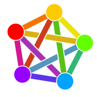

In this post I want to explain what the Fediverse is and why you should join it. I talk a bit about the technical stuff but this post is intended to be understood by anyone.

## Where does the name come from?

The name is a portmanteau of federation and universe. So the Fediverse is a federated universe.

This name represents it pretty well. The Fediverse is decentral web of social media platforms all connected to each other. Anyone can connect with anybody else even if their using completely different services. You can imagine it like email. Every user has an email address by a specific service but they can write with anyone they want and not just with users of the same service.

For those who are familiar with the classic social networks: Imagine using Twitter and seeing Instagram or Facebook posts in your timeline just like they would all be using Twitter. That is the Fediverse.

## Why is the Fediverse so important?

The old social media platforms are owned by companies. Not so is the Fediverse. First of all there are many services in the Fediverse so the whole thing cannot be owned. Just like the internet. So nobody can force the users into something and none can exploit a monopoly. 

But even the producers of Fediverse software are very different. It consists of mainly FOSS(Free and Open Source Software) which means the software is really free and developers can change things and help improving it. FOSS is incredibly important. It offers so many advantages that I will cover in a future post.

Because of this freedom making money is more challenging. But also the user doesn't get treated like trash. Because the user pays for the Fediverse in terms of donations.

So the software producers of the Fediverse are mainly volunteers or non profit organizations. Both want to make the internet a better place and not just want to make a bug.

But not only the software producers are acting in a fair way also the people who run the server are mainly volunteers, organizations or even states!

## Current culture in the Fediverse

### Who is in the Fediverse?

## Platforms

### Mastodon

### Pixelfed

### Peertube

### What about Threads (Meta)?



Now bigger companies are starting joining the Fediverse. The biggest is Threads made by Meta.

Currently threads is implementing the required ActivityPub logic to join the network. You can already follow the CEO of Instagram and few of the team. But it seems like the full connection will take a while to implement.

This topic is a controversy in the Fediverse. On one side stands that Meta is bringing a lot of users to the network but on the other side is Meta also well known for incredible bad privacy and being part of the surveillance capitalism.

A few instances even have made the ["Fedi-Pact"](https://fedidb.org/current-events/anti-meta-fedi-pact) and therefore will block Meta on the server side when they are joining. This has an impact of about 7% of active users on the open side of the Fediverse.

If a server does not block a specific other server the user still hast the power to do that. Here the founder of Mastodon explains his audience how that is done.


  

    <iframe src="https://mastodon.social/@Gargron/111587088958531028/embed" width="100%" height="275" allowfullscreen="allowfullscreen" sandbox="allow-scripts allow-same-origin allow-popups allow-popups-to-escape-sandbox allow-forms"></iframe>
  



## ActivityPub Protocol
