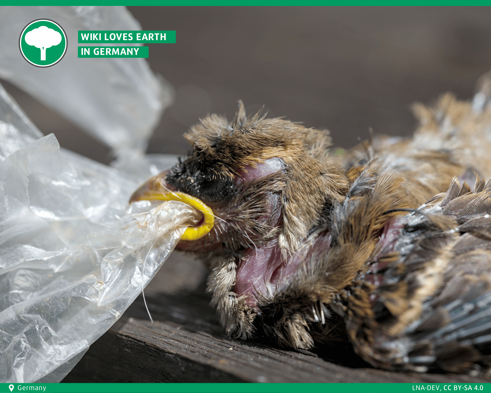

In my progress of getting better at photography I wanted to take part in a photo competition as some kind of motivation. I therefore took a look at several competitions out there in the last year. One caught my attention: The Wiki Loves Earth competition. I love Wikipedia and share a good proportion of its values. Information should be open and accessible to anyone. Therefore it sounded quite nice to me.

  
I later decided to take part in it. The requirements were that the photos are licensed under a Creative Commons (CC) license. As I publish most (currently all) of my photography under such licenses this was not an issue for me. More notable it was some kind of motivation knowing that now my images can be found and used by anyone one Wikipedia with the appropriate credit.

  
There were several categories: One [main category](https://wikilovesearth.org/wiki-loves-earth-international-presents-the-best-images-in-2025/) with a landscape and macro image which was hosted first on a national level after which the winners would compete internationally. The second category in which I late won was the [special category](https://wikilovesearth.org/winning-images-of-the-special-category-human-rights-and-environment-from-wiki-loves-earth-2025/) for environment and human rights.

I uploaded a couple of images from protected areas and a image of a dead bird baby which tried to swallow plastic and probably suffocated on it. The normal images were all from Germany so I competed there locally. In this local competition there were many good photos so my images did not rank especially high. So I had my fun and didn’t think much about the competition. A few months (or so) later I go a Wikipedia message and mail that my image won in the International Human Rights and Environment competition. I must admit that I was fairly surprised. After the okeyish result in the local competition I did not suspect that it would go so good for me in the special category. After seeing the message for the first time I spend some time with validating that it is real and not some crazy spearphishing attempt. But everything seemed perfectly fine. I was really happy at that day.

  
The special category does not have any super crazy prices but I got a nice diploma with some Wikipedia goodies. I especially like the pencil holder. Also my laptop now has a new sticker which is always a great plus.

  
TODO Insert image of the stuff here

  
Anyway it was a great competition and I had a lot of fun. I really look forward to participating again in 2026. Maybe I could motivate you to join me and many others.