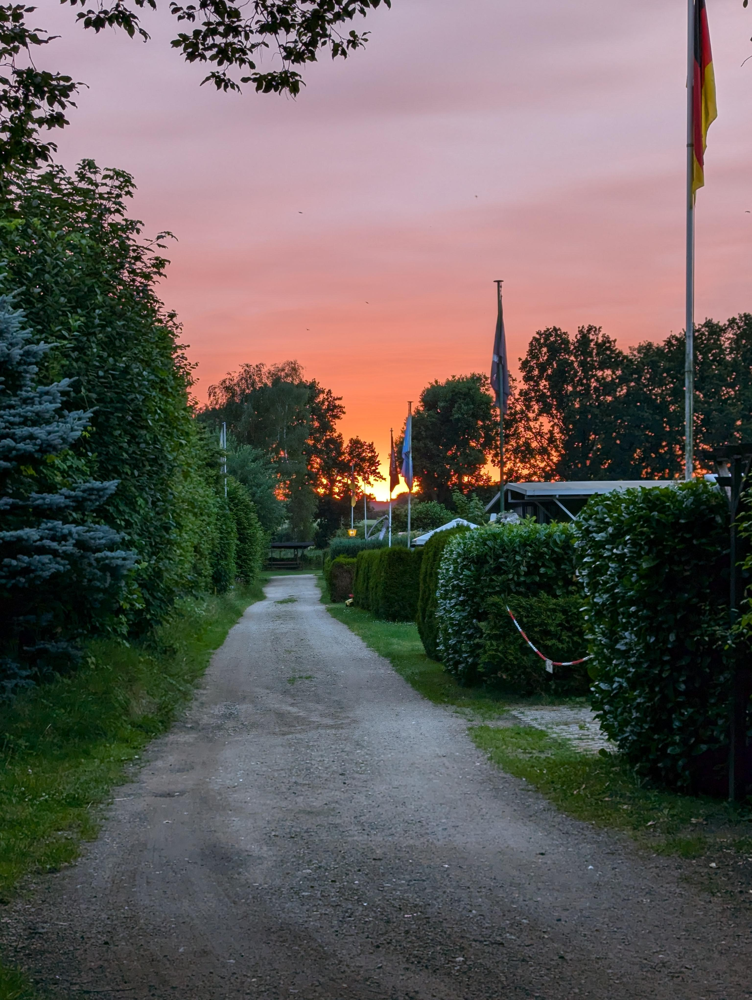
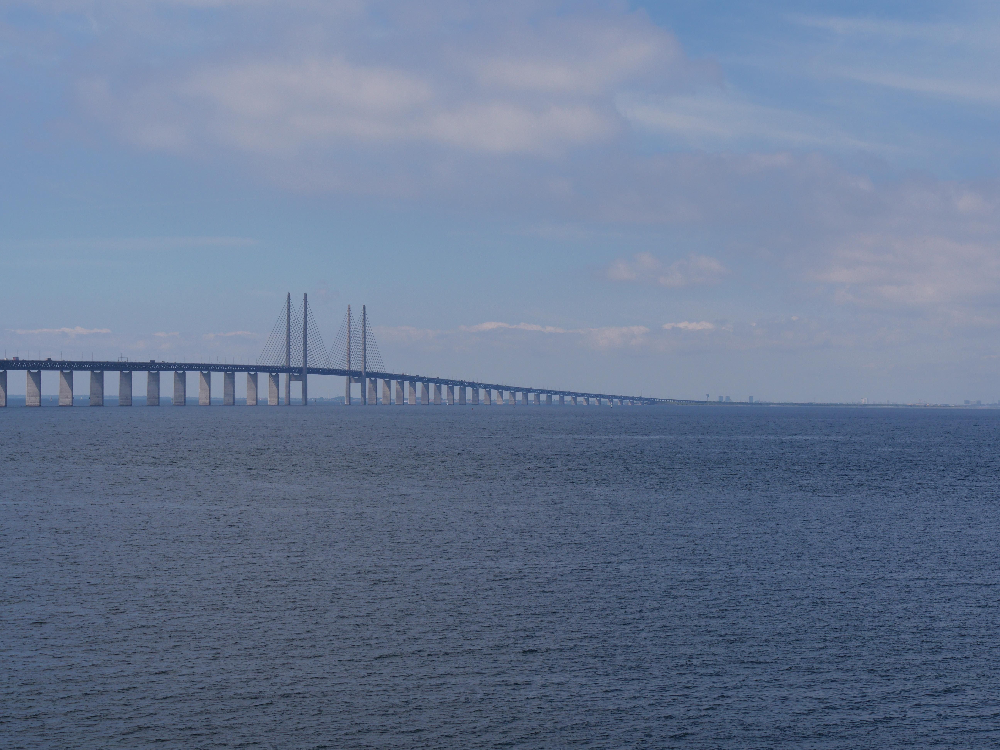
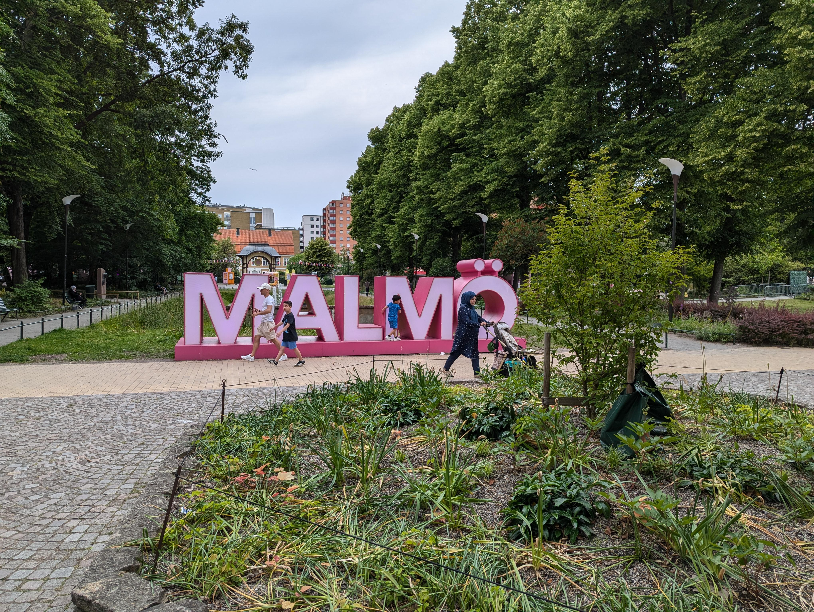

## Resa genom Tyskland och Danmark

I denn inlägg vill jag berätta om mina först resa till och genom södra Sverige. Jag har börjat den ungefär på Midsommar i Juni och resan tog slut tre veckor efter i Juli.

Jag har börjat mina resa i södra Tyskland tidigt i morgonen. Men den första dagen av mina resa var helt ospektakulärt eftersom jag kört nästan hela dagen upp till en liten campingplats nära Hamburg. Du kan ser precis ställe i kartan nedan. Det var ungefär halv sex när jag var där. Det var en fin liten campingplats nära en sjö och personalen var väldigt fin. Det äre väldigt interessant hur annars det är även i en andra del av Tyskland. Dialekten, mentalitäten och särskilt landskapen är väldigt annars jämförd med den bergigt landskap i södra Tyskland.

På nästa dagen har jag vaknat upp tidigt eftersom solen var upp och grodorna var så jävla högljudda. Jag hade frukost på campingplatsen och har bokad en billjet för Öresundsbron online. Det var midsommardagen förresten. Så min plan var att köra till Malmö så snabbt som möjligt och hittar någon midsommar fest där på stan.

Köra genom Danmark var fin och lite mindre stressig som köra så snabb på den tyska Autobahn. På vägen är flera stor bron som har imponerad mig som jag kört på dem och blicken på haven här och där var jättefint.

När jag har kommit till Öresundsbron var det jättekul att köra över den och kom ut från under haven. Utsikten var jättekul jag tycka. I Sverige var dem gatorna nästan tomt eftersom det var midsommar. Men jag hade en känsla av eviga vidder när jag körde mina första metrar genom Skåne.

Eftersom det har tog en långt tid köra upp from norra Tyskland har jag kört direkt till min hotell för dem nästa några dagarna. Jag har väljat en hotell i Sorgenfri, Malmö eftersom min natt i tält var inte bra. Jag hade ingen riktigt kudde och jag också tänka att campingplatser är inte nära centrumet.

{{< map coordinates="[{\"x\": 47.85, \"y\": 12.12}, {\"x\": 53.408508, \"y\": 10.595831}, {\"x\": 55.5980171, \"y\": 13.0220953 }]" >}}

## Malmö

Först jag har checkad in i min hotell. Jag försökte prata lite Svenska men jag pratade mest Engelska. Eftersom jag frågade efter midsommar festar på reception jag visste att det är någonting på Folketspark. Men när jag var där jag har lagt märke till att det är inte en riktigt midsommar fest och bara en liten händelse för familjer med barn. Så jag bar gott genom stan och tar en titt här och där. Men bara i närheten var jag kunde går utan en busbiljet.

Jag är lite ledsna att jag har mer eller mindre missad midsommar men kanske jag kan uppleva det på en andra gång.

På den nästa dagen har jar forskat hur jag kan använda bus i Skåne och hade användat appen som billjet den först gång. Som en programmerare jag har delade meningar um denna biljettar. Först av all är dem jätte enkel och bekväm men de kann också bli användat för att övervaka var någon är. Jag hoppas att daterna är bemött ansvarsfullt. Men nu jag hade mölighet att utforska hela stand och jag gjörde det. Det jättefint att sätta sig i bussen och körar runt stan och tar tit här eller där.

Jag hade parkerad min bil i närheten av hotellet. Där jag har gjort en stor fel. Jag har parkerad på den andra sidan av gatorna jag hade betalt... Så jag hag måste betala 800 SEK för parkering ytterligare till som jag hade betalt för parkering på andra sidan.

### Twisting Torso

### Parks och trädgårdar

### Museer och gallerier

### Strandpromenad

## Öland

{{< map coordinates="[{\"x\": 55.5980171, \"y\": 13.0220953 }, {\"x\": 57.174311, \"y\": 17.035819 }]" >}}

### Cyklar på Öland

### Strand

## Kalmar

{{< map coordinates="[{\"x\": 57.174311, \"y\": 17.035819 }, {\"x\": 56.671736, \"y\": 16.367111 }]" >}}

### Fest med studenter

## Stockholm

{{< map coordinates="[{\"x\": 56.671736, \"y\": 16.367111 }, {\"x\": 59.302125, \"y\": 18.094136 }]" >}}

## Göteborg

{{< map coordinates="[{\"x\": 59.302125, \"y\": 18.094136 }, {\"x\": 57.688636, \"y\": 11.987281 }]" >}}

## Tillbaka hem
