## Resa genom Tyskland och Danmark

I detta inlägg vill jag berätta om min första resa till och genom södra Sverige. Jag började den ungefär vid midsommar i juni och resan tog slut tre veckor senare i juli.

Jag började min resa i södra Tyskland tidigt på morgonen. Men den första dagen av min resa var helt ospektakulär eftersom jag körde nästan hela dagen upp till en liten campingplats nära Hamburg. Du kan se den exakta platsen på kartan nedan. Det var ungefär halv sex när jag kom fram. Det var en fin liten campingplats nära en sjö och personalen var väldigt trevlig. Det är väldigt intressant hur annorlunda det är även i en annan del av Tyskland. Dialekten, mentaliteten och särskilt landskapet är väldigt annorlunda jämfört med det bergiga landskapet i södra Tyskland.

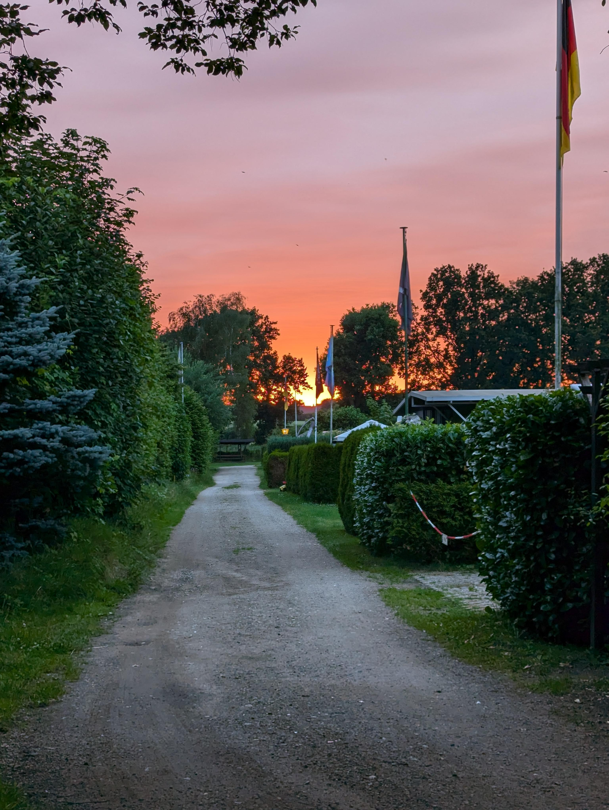

Nästa dag vaknade jag tidigt eftersom solen var uppe och grodorna var så jävla högljudda. Jag åt frukost på campingplatsen och bokade en biljett för [Öresundsbron](https://sv.wikipedia.org/wiki/%C3%96resundsf%C3%B6rbindelsen) online. Det var midsommardagen, förresten. Så min plan var att köra till Malmö så snabbt som möjligt och hitta någon midsommarfest där i stan.

Att köra genom Danmark var fint och lite mindre stressigt än att köra så snabbt på den tyska ***Autobahn***. På vägen finns flera stora broar som imponerade på mig när jag körde över dem och utsikten över havet här och där var jättefin.

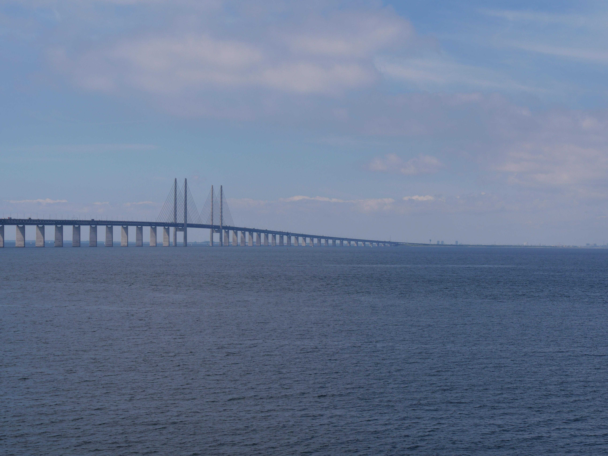

När jag kom till Öresundsbron var det jättekul att köra över den och komma upp från under havet. Utsikten var fantastisk, tyckte jag. I Sverige var gatorna nästan tomma eftersom det var midsommar. Men jag hade en känsla av eviga vidder när jag körde mina första meter genom Skåne.

Eftersom det tog lång tid att köra upp från norra Tyskland körde jag direkt till mitt hotell för de kommande dagarna. Jag hade valt ett hotell i Sorgenfri, [Malmö](https://malmo.se/), eftersom natten i tältet inte var bra. Jag hade ingen riktig kudde och jag tänkte också att campingplatser inte ligger nära centrum.

{{< map coordinates="[{\"x\": 47.85, \"y\": 12.12}, {\"x\": 53.408508, \"y\": 10.595831}, {\"x\": 55.5980171, \"y\": 13.0220953 }]" >}}

## Malmö

Först checkade jag in på mitt hotell. Jag försökte prata lite svenska, men jag pratade mest engelska. Eftersom jag frågade efter midsommarfester i receptionen fick jag veta att det fanns något på Folkets Park. Men när jag var där lade jag märke till att det inte var en riktig midsommarfest, bara en liten händelse för familjer med barn. Så jag gick bara runt genom stan och tittade lite här och där, men bara i närheten dit jag kunde gå utan bussbiljett.

Jag är lite ledsen att jag mer eller mindre missade midsommar, men kanske kan jag uppleva det en annan gång.

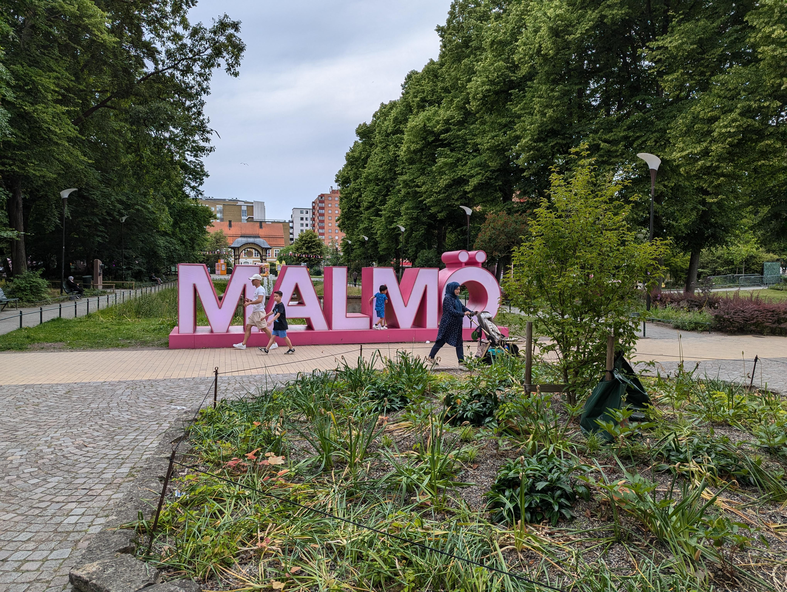

### Resa genom staden med bus

Nästa dag forskade jag i hur man använder bussarna i [Skåne](https://visitskane.com/) och använde appen för biljetten för första gången. Som programmerare har jag delade meningar om dessa biljetter. Först och främst är de jätteenkla och bekväma, men de kan också användas för att övervaka var någon är. Jag hoppas att datan hanteras ansvarsfullt. Men nu hade jag möjlighet att utforska hela staden och det gjorde jag. Det var jättefint att sätta sig på bussen, åka runt i stan och ta en titt här och där.

Jag hade parkerat min bil i närheten av hotellet. Där gjorde jag ett stort misstag. Jag parkerade på andra sidan av gatan än där jag hade betalat för parkering... Så jag var tvungen att betala 800 SEK för parkering, utöver vad jag redan betalat på den andra sidan.

### Twisting Torso

När jag var i Malmö såg jag många sevärdheter, till exempel [Twisting Torso](https://visitskane.com/classic-attractions/turning-torso). Jag tyckte om byggnaden eftersom den är något unikt och i närheten av tornet finns flera fina parker. Jag tänker att Malmö särskilt har många fina parker i allmänhet. Det var särskilt intressant när det var dimmigt i staden och tornet försvann i dimman.

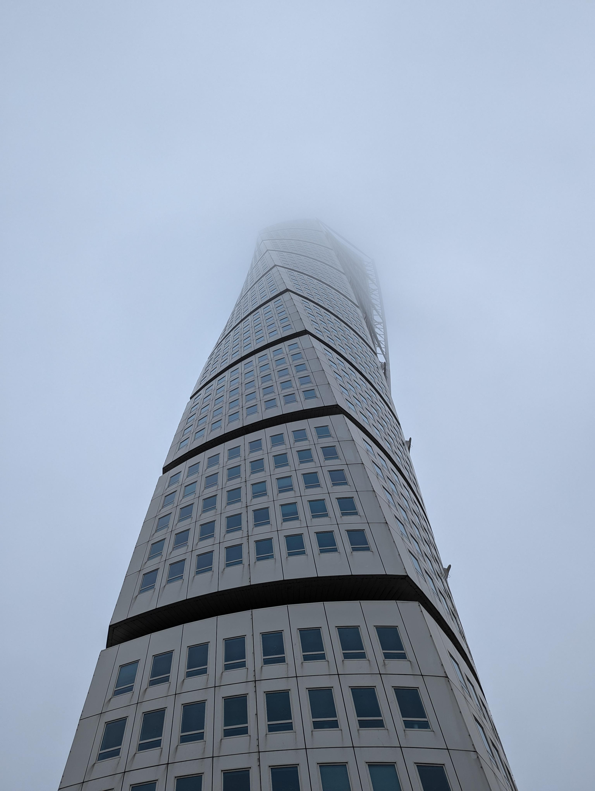

### Parker och trädgårdar

Som jag nämnde tidigare tycker jag att Malmö hade de bästa parkerna av de städer jag har besökt. Till exempel fanns det flera parker i närheten av Twisting Torso. En av dem hade till och med mycket vatten och om du hade tur kunde du se ankor. Jag gillar ankor, så det var jättefint att vara där och njuta av lite natur. Men det var inte den enda parken, jag såg många av dem.

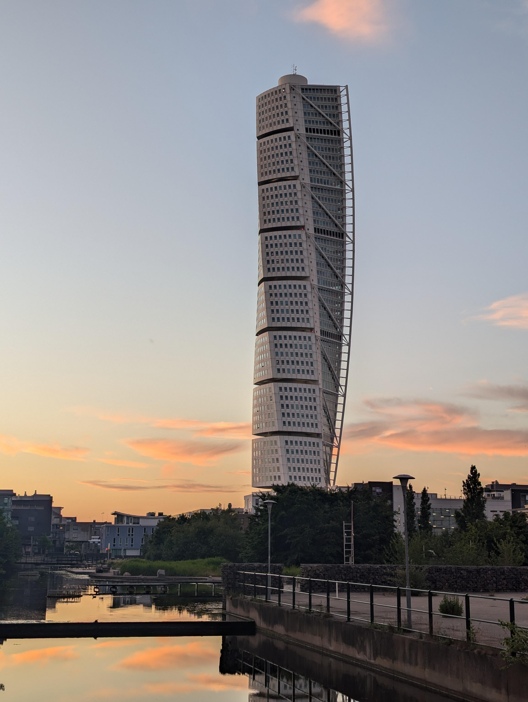

Det jag tycker är intressant är att jag har sett många kaniner i svenska städer. Till exempel i Malmö, både på en kyrkogård och i en park lite utanför staden, nära Öresundsbron. Om jag minns rätt såg jag också några kaniner i Göteborg och kanske till och med i Stockholm.


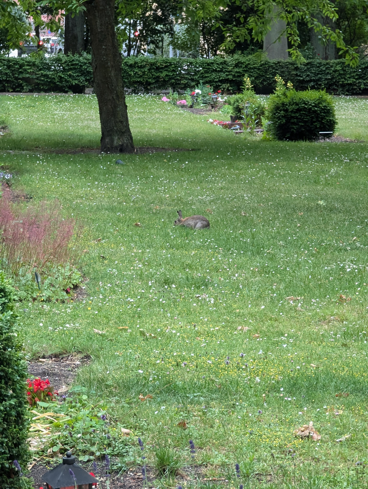


### Museer och gallerier

Jag besökte olika museer och gallerier när jag var i Malmö och också i hela Sverige. Till exempel var jag på [Malmöhus slott / Malmömuseum](https://malmo.se/Uppleva-och-gora/Konst-och-museer/Malmo-museum/Besok-Malmo-museum/Vara-byggnader/Slottet/Malmohus-slott.html) och [Teknikens och Sjöfartens hus](https://malmo.se/Uppleva-och-gora/Konst-och-museer/Malmo-museum/Besok-Malmo-museum/Vara-byggnader/Teknikens-och-sjofartens-hus.html). Det var intressant att se gammal teknologi där. Det var den huvudsakliga anledningen till att gå dit, men konstgalleriet var också intressant för mig eftersom jag aldrig hade varit på ett tidigare. Jag tyckte om många fotografier och teckningar, men en av dem var jätterolig. Du kan se en bild av den nedan. 

Jag tycker att den är rolig och en bra beskrivning av Malmö i allmänhet. Malmö verkar vara en väldigt vänsterorienterad stad med många olika kulturer. Jag gillar verkligen Malmös **öppna kultur** för flyktingar, HBTQ-personer och också mycket mer, som verkar vara stark.

Jag har hört några gånger att Sverige och i synnerhet Malmö har en hög brottslighet. [^brottslighetSverige] Men vad jag måste säga om detta är att jag kände mig aldrig osäker under hela min resa genom Sverige. Även om Malmö är statistiskt sett en kriminell stad känns det inte så och jag såg ingen typ av brott när jag var där. Jag såg inte ens mer än en eller två hemlösa. Det är helt annorlunda i Tyskland, även i mindre städer. Sverige kändes väldigt varmt och välkomnande!

Denna konst visar också den lilla syskongräl mellan Sverige och Danmark. Jag tycker att det är lite roligt och jag gillar sammanhållningen i hela Norden.

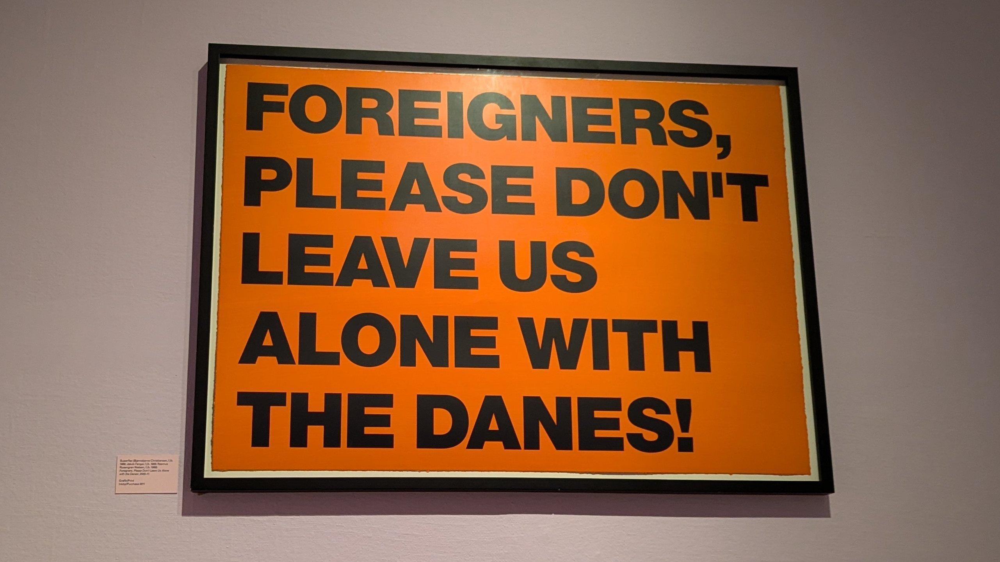

### Strandpromenaden

Jag tycker att den stora strandpromenaden är min favoritplats i hela Malmö. Det är verkligen vackert där. Man kan sitta på stora bänkar i trä, spela volleyboll, gå på en promenad i parken vid havet eller bada. Det är också många personer där, så jag kände mig inte ensam, även om jag reste ensam. En gång var det till och med en mås bredvid mig på bänken. Den var verkligen söt.

Utsikten är också vacker. Man har en vy över Öresundsbron och kan titta på båtar som kör under bron eller man kan titta på Köpenhamn om sikten är bra. Man kan till och med se plan landa och starta vid Köpenhamns flygplats.

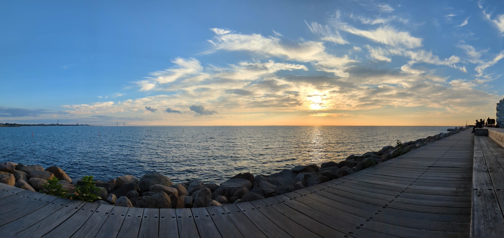

### En liten kulturchock

Vad jag tyckte var komiskt är att fönstren i Malmö öppnades annorlunda än i Tyskland. När jag vred handtaget i sidled vinklade fönstret och om jag vred uppåt öppnades det helt. Det var jättekonstigt. Men jag tänker att alla andra fönster som jag har sett i Sverige öppnade likadant som de tyska. [^fönster]


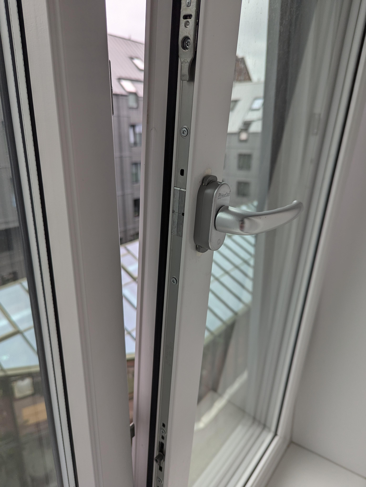


## Öland

> Öland är Sveriges näst största ö, landet med den mesta ön i hela världen. Det är solen och vindens ö.

Efter några dagar i Malmö, som jag verkligen kände en koppling till, körde jag vidare till mitt nästa stopp: Öland. Men eftersom jag hade planerat att tälta på Öland, behövde jag köpa en kudde. 

Så jag körde till Ikea i Kalmar och köpte en väldigt fin kudde som är svart med olika mönster av älgar, blommor och frukter i vitt. Väldigt fin och även producerad i Estland. Jag beställde också köttbullar på svenska, även om jag av misstag sa att jag ville ha "någonting" för dryck istället för "ingenting". Men det var första gången jag pratade med någon helt på svenska, så det var stort för mig.


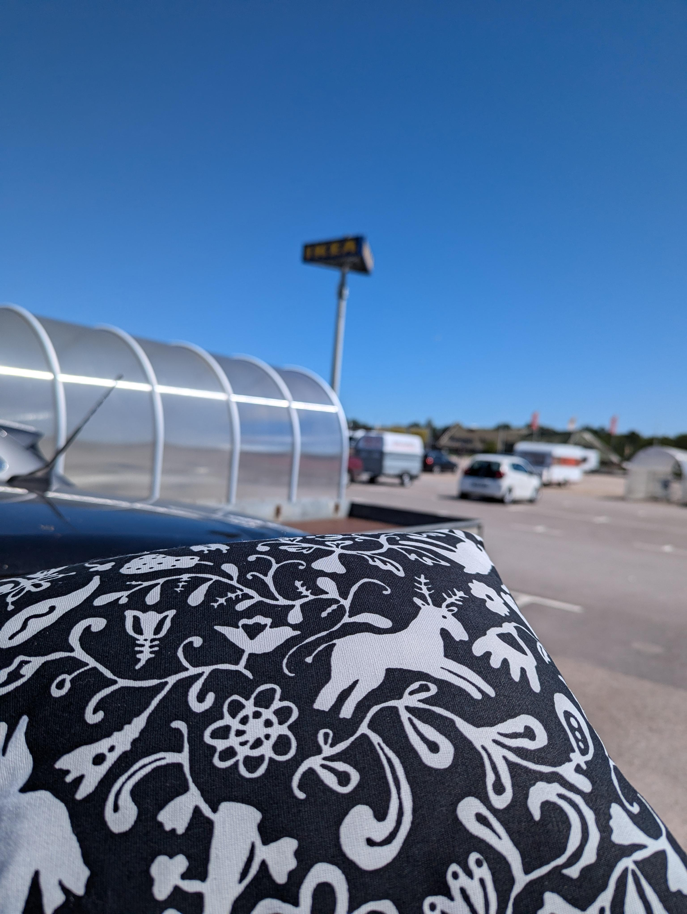


{{< map coordinates="[{\"x\": 55.5980171, \"y\": 13.0220953 }, {\"x\": 57.174311, \"y\": 17.035819 }]" >}}

På Öland letade jag efter en campingplats som tar emot personer under 23 år, men det var svårt. Efter ett tag trodde jag att jag hade hittat en och körde dit. Efter att jag checkat in och satt upp mitt tält märkte jag att också denna campingplats endast var för personer över 23 år. Men det var absolut inget problem, så jag tänkte att det inte skulle ha varit ett problem på de andra campingplatserna heller.

### Resa ensam och ensamhet

En annan sak som jag inte har pratat så mycket om tidigare är hur det är att resa ensam. Jag måste säga att i början trodde jag inte att det skulle vara möjligt. Men i städerna kände jag mig inte så ensam. På en campingplats på Öland var det en annan sak. Det är verkligen vackert där, men jag var ensam och det kändes inte bra. Jag lyssnade mycket på poddar på grund av detta, vilket hjälpte, men jag vet inte om det är en bra lösning.

Å andra sidan har en ensam resa sina fördelar. Du kan göra vad du vill och chansen att träffa nya personer är högre, tror jag. Som du kan se i kapitlet om [Kalmar](#kalmar), träffade jag någon, även jag som är inåtvänd och blyg.

### Strand

Den viktigaste saken på en sommarsemester är att bada och vara på stranden, tycker jag. Saker som jag otroligt nog inte gjort mycket av. Men Öland var ett undantag. Stranden där var verkligen vacker och generellt kändes Öland mer som en ö i Medelhavet än i Östersjön. Det var varmt och solen var framme hela tiden.

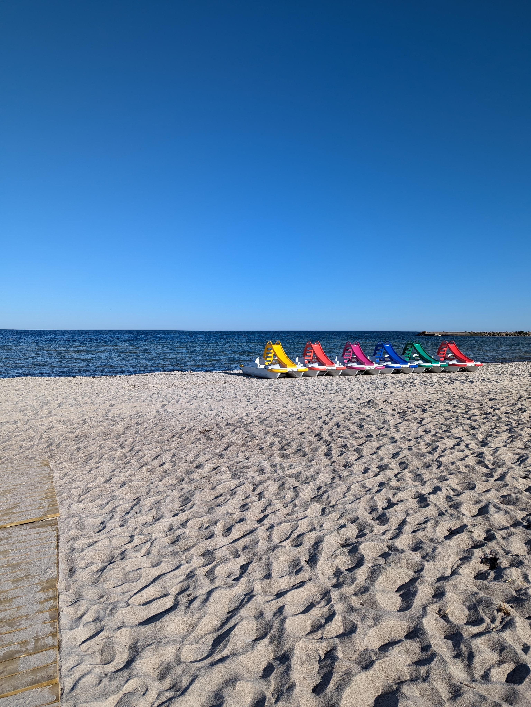

### Lammburgare

En dag åt jag en väldigt god lammburgare, som är en specialitet på ön. Den var urgod och jag beställde den helt på svenska. Jag var så lättad över att jag kunde kommunicera och att ingen försökte växla till engelska. (Det gällde nästan hela tiden i Sverige, förutom en gång på en bensinstation.)

### Cykla på Öland

En av de bra sakerna med att resa ensam var att jag kunde ta med mig min cykel. Jag använde den när jag var på Öland och cyklade runt lite. En gång hamnade jag mitt på en strand omgiven av kor och jag behövde hitta en väg tillbaka till vägen. Det blev ett litet äventyr.

### Köra runt Öland med bilen

En annan dag körde jag runt hela Öland med bilen och stannade till här och där. Det var jättespännande och jag såg många intressanta platser. Till exempel finns det en stor kalkstensöken i mitten och södra delen av ön. Den liknade verkligen en ö i Medelhavet. Fascinerande!

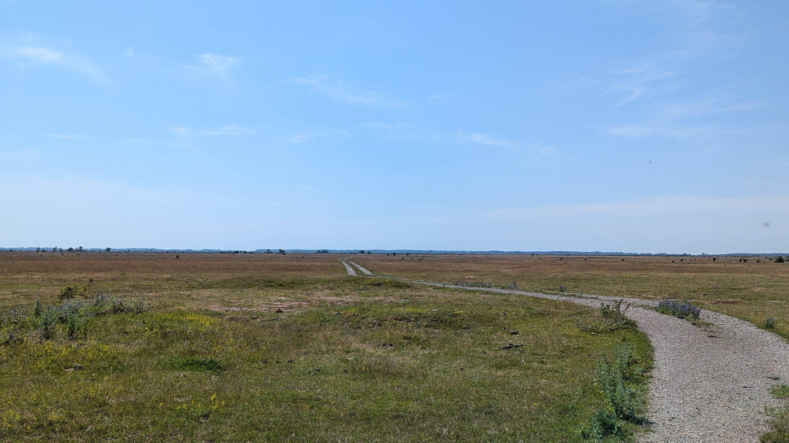

## Kalmar

Jag var inte länge i Kalmar, men jag tänkte att jag åtminstone skulle besöka staden för en dag. Och det gjorde jag.

{{< map coordinates="[{\"x\": 57.174311, \"y\": 17.035819 }, {\"x\": 56.671736, \"y\": 16.367111 }]" >}}

Jag körde ner till Kalmar och promenerade genom staden. Jag tog en titt på universitetet, hamnen och ett museum. Det var väldigt intressant. Museet, kallat Kalmar Slott, var riktigt roligt att besöka. I slottet, som ligger vid kusten, fanns olika utställningar med information på både svenska och engelska. Jag använde båda språken så att jag inte behövde vänta. Det fanns även personer utklädda till prinsessor, hovdamer och riddare som agerade som om de verkligen levde på den tiden. Det var fint att se historien komma till liv och lära sig något om Kalmarunionen. När jag var där hade de även en [häxutställning](https://kalmarslott.se/nyheter/haxor-ny-utstallning/), vilket var min första introduktion till häxor i Sverige. Också väldigt spännande. Jag försökte läsa all information på svenska, men jag förstod inte riktigt allt till hundra procent.

### Fest med studenter

Nu kommer vi till den bästa delen av min resa. Först måste jag förklara att jag är en blyg och inåtvänd person. Jag arbetar som programmerare och har inte mycket kontakt med främlingar. Jag tycker att det är väldigt svårt att ta initiativ och börja prata med någon, men när jag väl kommer igång är det inga problem längre.

Jag promenerade genom Kalmar och hörde plötsligt musik från någonstans. Så jag gick dit. Det visade sig vara en liten hippie-/alternativfestival. Där var det många studenter och andra unga personer som nyligen slutat skolan. Jag stod och tittade på allt från avstånd under en lång tid, kanske en eller två timmar. Till slut gick jag ner till platsen där människor dansade, medan andra satt på gräset bredvid. Jag satte mig bara ner någonstans och försökte vara avslappnad. Jag pratade till och med med en kille som var ett eller två år yngre än jag. Det var redan ett stort steg för mig att ta initiativ och börja en konversation. Men samtalet tog slut ganska snabbt.

Ungefär tio minuter efter att jag satt mig kom jag in i en grupp studenter, eftersom de mer eller mindre "föll över mig." De frågade om jag ville hänga med dem. Det var en fantastisk upplevelse för mig att se hur enkelt det kunde vara att komma in i en grupp, även om jag tror att jag hade mycket tur.

Efter festivalen gick vi till en liten bar, där vi drack öl, pratade mycket och dansade lite. Det var verkligen roligt och jag hade en väldigt fin kväll. Det var intressant att höra var alla kom ifrån och vad de studerade. Nästan alla var inte från Sverige, så vi pratade engelska. 

Till sist, om någon av er läser det här: Tack för kvällen!

Efteråt sov jag på ett litet vandrarhem som jag hade bokat helt på svenska. Jag var väldigt stolt över mig själv när jag lyckades med det!

## Stockholm

Nästa morgon behövde jag stiga upp tidigt eftersom jag bara hade bokat en natt på vandrarhemmet och ville hinna duscha innan jag checkade ut. Jag ville inte heller missa frukosten 😉 Jag övervägde om jag skulle stanna längre i Kalmar eftersom jag hade träffat nya människor för första gången under resan, men jag bestämde att kvällen innan var en bra avslutning. Så jag körde vidare mot Stockholm.

{{< map coordinates="[{\"x\": 56.671736, \"y\": 16.367111 }, {\"x\": 59.302125, \"y\": 18.094136 }]" >}}

Det var faktiskt en ganska lång resa till Stockholm. Men jag körde det mesta av sträckan med bara en eller två pauser, så jag var framme efter några timmar. Jag hade valt ett hotell i Södra Hammarbyn som jag tänka är en god miljö.

### Storstad

En sak som blev tydlig direkt var att Stockholm spelar i en helt annan liga jämfört med Malmö. Stockholm är mycket större och både infrastrukturen och byggnaderna känns mer som en riktig storstad. Men det har också sina nackdelar. Till exempel tycker jag att Malmö är renare än Stockholm.

Jag kommer från en liten by i södra Tyskland och har aldrig tillbringat längre tid i en storstad än några timmar, så det var en helt ny upplevelse för mig. Och jag måste säga att det var roligt att utforska städer, inklusive Stockholm. Det finns många fina platser runt om i städerna och jag kan tänka mig att det också kan vara trevligt att bo där.

Jag tycker att Stockholm är särskilt vackert för att vara en så stor stad. Det finns många parker att promenera i och det stora antalet vattenområden har en magisk effekt på mig.

### Bokhandeln

En av mina favoritaktiviteter var att besöka flera bokhandlar. Jag vet inte varför, men det var mysigt att gå runt och leta efter böcker som verkade intressanta. Särskilt fascinerad var jag av [Science Fiction Bokhandeln](https://www.sfbok.se/), inte bara i Stockholm utan också i den andra stora städerna.

Jag köpte flera böcker. En av dem var [*Balladen om sångfåglar och ormar*](https://www.svt.se/kultur/bokrecension-balladen-om-sangfaglar-och-ormar), som jag tidigare hade läst på tyska, men nu ville läsa på svenska. Jag köpte också [*Krigarhjärta*](https://www.norstedts.se/bok/9789113135373/krigarhjarta), *Blå* och den svenska versionen av *1984*. Jag har redan hunnit läsa *Hungerspelen* och *Krigarhjärta* när jag skriver detta och jag ser fram emot att läsa de andra när jag har lite tid.

Jag köpte *Blå* eftersom jag hade sett den rekommenderas i en [video](https://www.youtube.com/watch?v=uWQYqcFX8JE) av Ilys, där hon pratade om hur man kan lära sig norska eller andra språk. Videon är verkligen sevärd för alla som vill lära sig ett nytt språk! När jag såg boken läste jag baksidestexten, som verkade intressant, så jag bestämde mig för att köpa den.

### Museer

Vädret var inte alltid på min sida under min vistelse i Stockholm, så det var perfekt att besöka några museer. Jag gick till [Nobelmuseet](https://sv.wikipedia.org/wiki/Nobelmuseet) och [Nordiska museet](https://www.nordiskamuseet.se/).

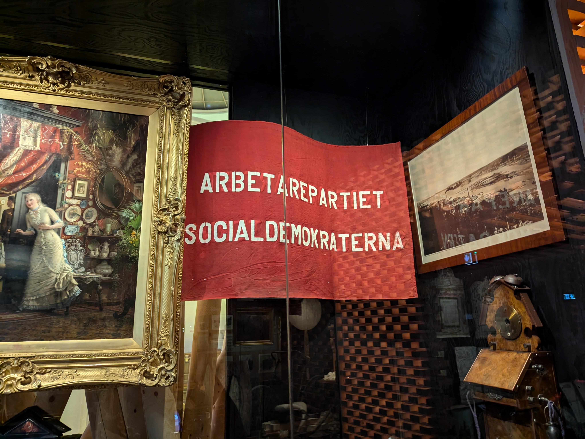

Jag tyckte att Nobelmuseet var okej, men Nordiska museet var mycket bättre. Det var också mycket större, med mer utrymme att utforska. Det var dessutom det första museet under min resa som hade en tydlig politisk dimension, vilket jag tyckte var väldigt intressant.

Tyvärr missade jag möjligheten att få en guidad visning i riksdagen, vilket jag verkligen hade uppskattat. Men kanske jag kan göra det nästa gång.

### Rundtur i skärgården

Stockholm är känt för sin stora skärgård och en populär turistattraktion är att ta en båttur ut på havet och runt öarna. Jag är vanligtvis inte en stor vän av turistaktiviteter, men den här gången visste jag inte hur jag annars skulle kunna ta mig ut till skärgården, så jag valde att åka på en turistbåttur.

Det var verkligen vackert där ute. Men skärgården är så stor att en båttur på några timmar bara täcker den inre delen. Ändå var det en fin upplevelse och jag kunde ta några bilder av både naturen och byggnaderna.

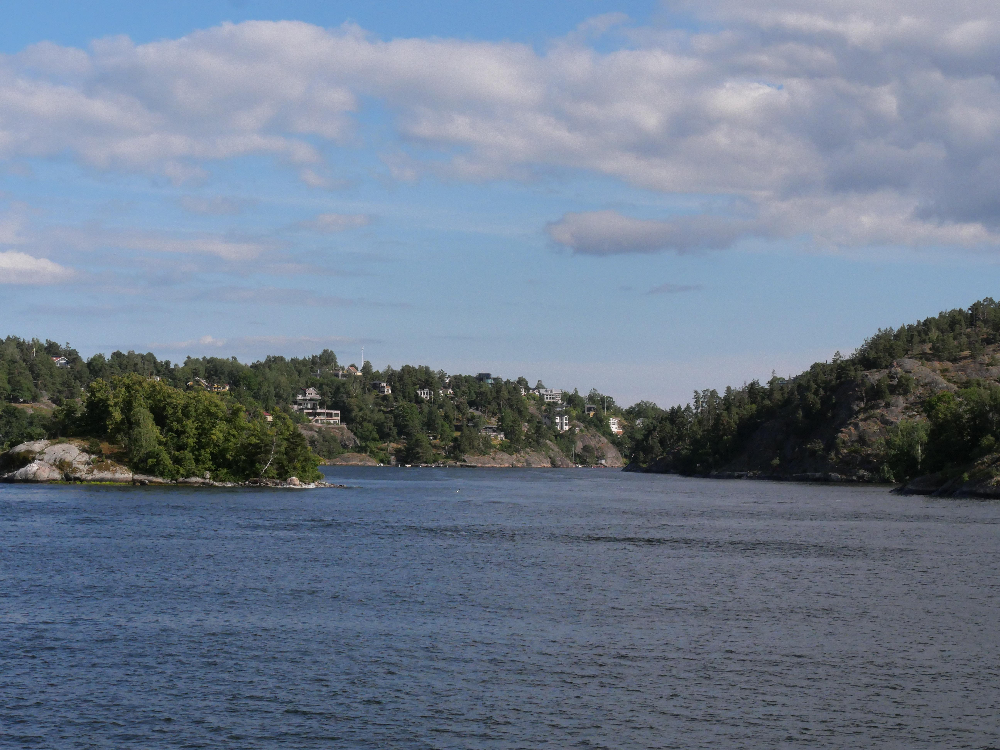

## Göteborg

Nu kommer vi till den sista staden på min resa. Efter några dagar i Stockholm körde jag söderut mot Göteborg. På vägen tog jag omvägar genom skogar och mindre vägar som verkade intressanta – något jag nu ångrar att jag inte gjorde oftare under resan. Efter nästan en hel dag bakom ratten nådde jag Göteborg.

{{< map coordinates="[{\"x\": 59.302125, \"y\": 18.094136 }, {\"x\": 57.688636, \"y\": 11.987281 }]" >}}

Jag måste erkänna att jag var ganska trött när jag kom hit. Efter två veckors resande började energin ta slut och vädret var inte heller det bästa. Därför blev det färre aktiviteter här än i tidigare städer, vilket ändå kändes okej – jag behövde verkligen lite lugnare tempo.

### Försvarsmuseet

En av de saker jag faktiskt gjorde var att besöka en gammal bunker som idag fungerar som försvarsmuseum. Det var spännande att komma nära olika flygplan och andra militära objekt. Men jag kan inte låta bli att känna en viss ambivalens när jag ser sådana saker. De är tekniskt imponerande och ofta vackra i sitt utförande, men deras potentiella användning är skrämmande. Det är viktigt att de enbart används i försvarssyfte – aldrig för attacker eller säljas till andra länderna som använder dem till gjöra attacker.

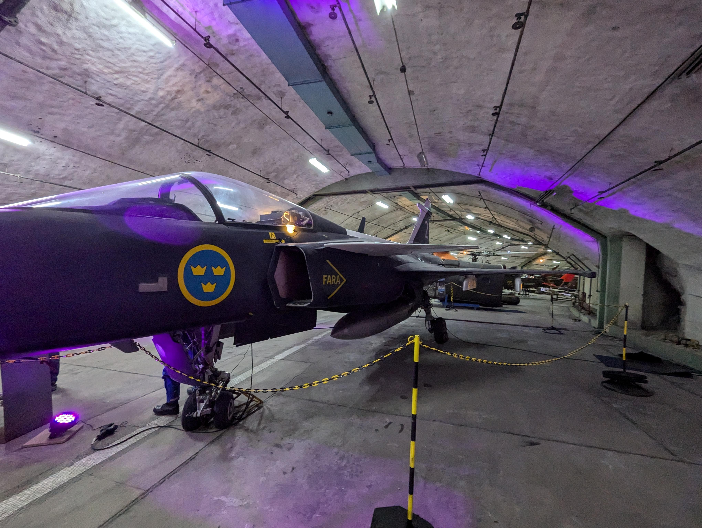

Museet visade också kultur och tidningar från tiden kring andra världskriget. Det var intressant, men samtidigt lite skrämmande. Också andra saker som en svensk atombomb var beskrivit ner där.

### Staden

Jag vet faktiskt inte riktigt vad jag ska säga om Göteborg. Kanske berodde det på vädret, kanske på min brist på energi, men jag fick intrycket av att Göteborg var lite tråkigt. Samtidigt känns det inte rättvist att döma staden utifrån detta enda besök. Jag tror jag måste återvända någon gång i framtiden och ge staden en ny chans – förmodligen under bättre förhållanden.

## Tillbaka hem

Efter några dagar i Göteborg var det dags att avsluta resan och köra hemåt. Första etappen tog mig tillbaka till Malmö, där jag köpte några souvenirer till mina nära och kära. Därefter körde jag vidare till Kolding i Danmark, där jag övernattade nära Koldingarenan. Nästa dag gick resan tillbaka genom Tyskland och till slut hem.

{{< map coordinates="[{\"x\": 57.688636, \"y\": 11.987281 }, {\"x\": 55.464744, \"y\": 9.476542 }, {\"x\": 48.70354 , \"y\": 9.65209 }, {\"x\": 47.85, \"y\": 12.12}]" >}}

## Tack för att du läste

Tack för att du läste den här texten! Jag uppskattar det verkligen ❤️ Jag vet inte om någon faktiskt är intresserad av vad jag skriver, men att skriva hjälper mig att förbättra min svenska, så det känns värdefullt för mig oavsett.

Om du vill se fler bilder från resan (jag tog många fler!), kan du ta en titt på [Fotografi](/en/gallery). Jag har inte publicerat något där ännu, men jag planerar att göra det snart!

## Fotnoter

[^brottslighetSverige]: Brottslighet i Sverige är en väldigt känsligt ämne som jag vill inte diskutera mycket i den inlägg, eftersom det är för omfattande för att behandla i detalj här. Men kanske vill jag göra det i framtiden.
[^fönster]: Under tiden har jag hört att det också finns någon av denna komiskt fostrar i Tyskland. Men jag har aldrig sett något sådant själv...
