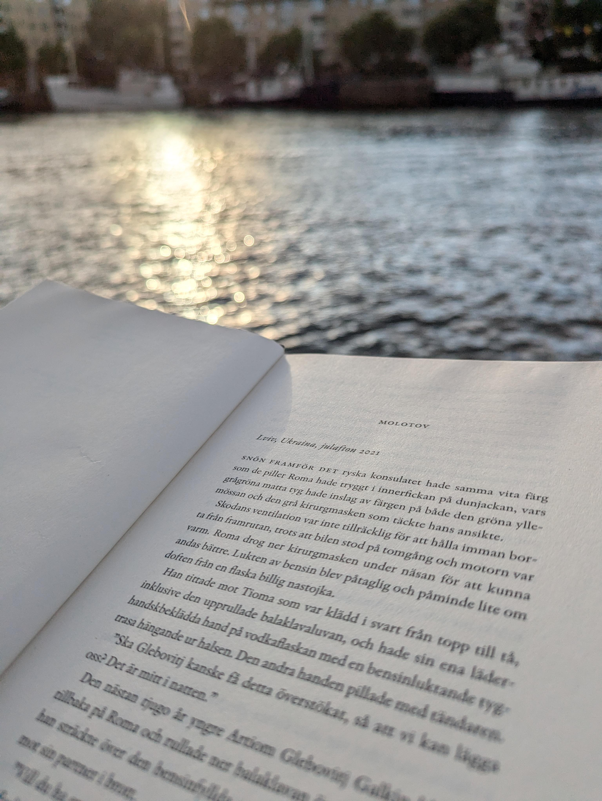

## Resa genom Tyskland och Danmark

I detta inlägg vill jag berätta om min första resa till och genom södra Sverige. Jag började den ungefär vid midsommar i juni och resan tog slut tre veckor senare i juli.

Jag började min resa i södra Tyskland tidigt på morgonen. Men den första dagen av min resa var helt ospektakulär eftersom jag körde nästan hela dagen upp till en liten campingplats nära Hamburg. Du kan se den exakta platsen på kartan nedan. Det var ungefär halv sex när jag kom fram. Det var en fin liten campingplats nära en sjö, och personalen var väldigt trevlig. Det är väldigt intressant hur annorlunda det är även i en annan del av Tyskland. Dialekten, mentaliteten och särskilt landskapet är väldigt annorlunda jämfört med det bergiga landskapet i södra Tyskland.

Nästa dag vaknade jag tidigt eftersom solen var uppe och grodorna var så jävla högljudda. Jag åt frukost på campingplatsen och bokade en biljett för Öresundsbron online. Det var midsommardagen, förresten. Så min plan var att köra till Malmö så snabbt som möjligt och hitta någon midsommarfest där i stan.

Att köra genom Danmark var fint och lite mindre stressigt än att köra så snabbt på den tyska ***Autobahn***. På vägen finns flera stora broar som imponerade på mig när jag körde över dem och utsikten över havet här och där var jättefin.

När jag kom till Öresundsbron var det jättekul att köra över den och komma upp från under havet. Utsikten var fantastisk, tyckte jag. I Sverige var gatorna nästan tomma eftersom det var midsommar. Men jag hade en känsla av eviga vidder när jag körde mina första meter genom Skåne.

Eftersom det tog lång tid att köra upp från norra Tyskland körde jag direkt till mitt hotell för de kommande dagarna. Jag hade valt ett hotell i Sorgenfri, Malmö, eftersom natten i tältet inte var bra. Jag hade ingen riktig kudde och jag tänkte också att campingplatser inte ligger nära centrum.

{{< map coordinates="[{\"x\": 47.85, \"y\": 12.12}, {\"x\": 53.408508, \"y\": 10.595831}, {\"x\": 55.5980171, \"y\": 13.0220953 }]" >}}

## Malmö

Först checkade jag in på mitt hotell. Jag försökte prata lite svenska, men jag pratade mest engelska. Eftersom jag frågade efter midsommarfester i receptionen fick jag veta att det fanns något på Folkets Park. Men när jag var där lade jag märke till att det inte var en riktig midsommarfest, bara en liten händelse för familjer med barn. Så jag gick bara runt genom stan och tittade lite här och där, men bara i närheten dit jag kunde gå utan bussbiljett.

Jag är lite ledsen att jag mer eller mindre missade midsommar, men kanske kan jag uppleva det en annan gång.

### Nästa dag

Nästa dag forskade jag i hur man använder bussarna i Skåne och använde appen för biljetten för första gången. Som programmerare har jag delade meningar om dessa biljetter. Först och främst är de jätteenkla och bekväma, men de kan också användas för att övervaka var någon är. Jag hoppas att datan hanteras ansvarsfullt. Men nu hade jag möjlighet att utforska hela staden, och det gjorde jag. Det var jättefint att sätta sig på bussen, åka runt i stan och ta en titt här och där.

Jag hade parkerat min bil i närheten av hotellet. Där gjorde jag ett stort misstag. Jag parkerade på andra sidan av gatan än där jag hade betalat för parkering... Så jag var tvungen att betala 800 SEK för parkering, utöver vad jag redan betalat på den andra sidan.

### Twisting Torso

När jag var i Malmö såg jag många sevärdheter, till exempel Twisting Torso. Jag tyckte om byggnaden eftersom den är något unikt, och i närheten av tornet finns flera fina parker. Jag tänker att Malmö särskilt har många fina parker i allmänhet. Det var särskilt intressant när det var dimmigt i staden och tornet försvann i dimman.

### Parker och trädgårdar

Som jag nämnde tidigare tycker jag att Malmö hade de bästa parkerna av de städer jag har besökt. Till exempel fanns det flera parker i närheten av Twisting Torso. En av dem hade till och med mycket vatten, och om du hade tur kunde du se ankor. Jag gillar ankor, så det var jättefint att vara där och njuta av lite natur.

Men det var inte den enda parken, jag såg många av dem. Det jag tycker är intressant är att jag har sett många kaniner i svenska städer. Till exempel i Malmö, både på en kyrkogård och i en park lite utanför staden, nära Öresundsbron. Om jag minns rätt såg jag också några kaniner i Göteborg och kanske till och med i Stockholm.





### Museer och gallerier

Jag besökte olika museer och gallerier när jag var i Malmö och också i hela Sverige. Till exempel var jag på Malmöhus / Malmömuseum och Teknikens och Sjöfartens hus. Det var intressant att se gammal teknologi där. Det var den huvudsakliga anledningen till att gå dit, men konstgalleriet var också intressant för mig eftersom jag aldrig hade varit på ett tidigare. Jag tyckte om många fotografier och teckningar, men en av dem var jätterolig. Du kan se en bild av den nedan. 

Jag tycker att den är rolig och en bra beskrivning av Malmö i allmänhet. Malmö verkar vara en väldigt vänsterorienterad stad med många olika kulturer och också många migranter. Men de många kulturer som möts här kan också skapa problem. Kriminaliteten och mordraten i Malmö är bland de högsta i hela Europa. Men jag tänker att det beror på att integrationen av flyktingarna har misslyckats. Samtidigt gillar jag verkligen Malmös öppna kultur för flyktingar och också HBTQ-personer, som verkar vara stark i Malmö.

Vad jag måste säga om detta: Jag kände mig aldrig osäker under hela min resa genom Sverige. Även om Malmö är statistiskt sett en väldigt kriminell stad känns det inte så, och jag såg ingen typ av brott när jag var där. Jag såg inte ens mer än en eller två hemlösa. Det är helt annorlunda i Tyskland, även i mindre städer. Sverige kändes väldigt varmt och välkomnande!

Denna konst visar också den lilla syskongräl mellan Sverige och Danmark. Jag tycker att det är lite roligt, och jag gillar sammanhållningen i hela Norden.

### Strandpromenaden

Jag tycker att den stora strandpromenaden är min favoritplats i hela Malmö. Det är verkligen vackert där. Man kan sitta på stora bänkar i trä, spela volleyboll, gå på en promenad i parken vid havet eller bada. Det är också många personer där, så jag kände mig inte ensam, även om jag reste ensam. En gång var det till och med en mås bredvid mig på bänken. Den var verkligen söt.

Utsikten är också vacker. Man har en vy över Öresundsbron och kan titta på båtar som kör under bron eller man kan titta på Köpenhamn om sikten är bra. Man kan till och med se plan landa och starta vid Köpenhamns flygplats.

### En liten kulturchock

Vad jag tyckte var komiskt är att fönstren i Malmö öppnades annorlunda än i Tyskland. När jag vred handtaget i sidled vinklade fönstret och om jag vred uppåt öppnades det helt. Det var jättekonstigt. Men jag tänker att alla andra fönster som jag har sett i Sverige öppnade likadant som de tyska.





## Öland

> Öland är Sveriges näst största ö, landet med den mesta ön i hela världen. Det är solen och vindens ö.

Efter några dagar i Malmö, som jag verkligen kände en koppling till, körde jag vidare till mitt nästa stopp: Öland. Men eftersom jag hade planerat att tälta på Öland, behövde jag köpa en kudde. 

Så jag körde till Ikea i Kalmar och köpte en väldigt fin kudde som är svart med olika mönster av älgar, blommor och frukter i vitt. Väldigt fin och även producerad i Estland. Jag beställde också köttbullar på svenska, även om jag av misstag sa att jag ville ha "någonting" för dryck istället för "ingenting". Men det var första gången jag pratade med någon helt på svenska, så det var stort för mig.





{{< map coordinates="[{\"x\": 55.5980171, \"y\": 13.0220953 }, {\"x\": 57.174311, \"y\": 17.035819 }]" >}}

På Öland letade jag efter en campingplats som tar emot personer under 23 år, men det var svårt. Efter ett tag trodde jag att jag hade hittat en och körde dit. Efter att jag checkat in och satt upp mitt tält märkte jag att också denna campingplats endast var för personer över 23 år. Men det var absolut inget problem, så jag tänkte att det inte skulle ha varit ett problem på de andra campingplatserna heller.

### Resa ensam och ensamhet

En annan sak som jag inte har pratat så mycket om tidigare är hur det är att resa ensam. Jag måste säga att i början trodde jag inte att det skulle vara möjligt. Men i städerna kände jag mig inte så ensam. På en campingplats på Öland var det en annan sak. Det är verkligen vackert där, men jag var ensam, och det kändes inte bra. Jag lyssnade mycket på poddar på grund av detta, vilket hjälpte, men jag vet inte om det är en bra lösning.

Å andra sidan har en ensam resa sina fördelar. Du kan göra vad du vill, och chansen att träffa nya personer är högre, tror jag. Som du kan se i kapitlet om [Kalmar](#kalmar), träffade jag någon, även jag som är inåtvänd och blyg.

### Strand

Den viktigaste saken på en sommarsemester är att bada och vara på stranden, tycker jag. Saker som jag otroligt nog inte gjort mycket av. Men Öland var ett undantag. Stranden där var verkligen vacker, och generellt kändes Öland mer som en ö i Medelhavet än i Östersjön. Det var varmt och solen var framme hela tiden.

### Lammburgare

En dag åt jag en väldigt god lammburgare, som är en specialitet på ön. Den var urgod, och jag beställde den helt på svenska. Jag var så lättad över att jag kunde kommunicera och att ingen försökte växla till engelska. (Det gällde nästan hela tiden i Sverige, förutom en gång på en bensinstation.)

### Cykla på Öland

En av de bra sakerna med att resa ensam var att jag kunde ta med mig min cykel. Jag använde den när jag var på Öland och cyklade runt lite. En gång hamnade jag mitt på en strand omgiven av kor och jag behövde hitta en väg tillbaka till vägen. Det blev ett litet äventyr.

### Köra runt Öland med bilen

En annan dag körde jag runt hela Öland med bilen och stannade till här och där. Det var jättespännande och jag såg många intressanta platser. Till exempel finns det en stor kalkstensöken i mitten och södra delen av ön. Den liknade verkligen en ö i Medelhavet. Fascinerande!

## Kalmar

Jag var inte långt i Kalmar men jag tänkte att gå dör åtminstone för en dag. Och jag gjörde det.

{{< map coordinates="[{\"x\": 57.174311, \"y\": 17.035819 }, {\"x\": 56.671736, \"y\": 16.367111 }]" >}}

Jag har kört ner till Kalmar och gått genom stan. Tog en tit på universiteten, haven och till en museum. Det var väldigt interessant. Museumet är kallat Kalmar Slott och det var väldigt kul. I denna slot på kusten är olika utställningar med visningar på Svenska och Engelska. Jag har användad både så att jag måste inte vänta. Där var även personer som prinsessa och hovdamen som agerade som dem var dem på riktigt. Det var fin att titta på den historien och lära sig något om Kalmarer Unionen. När jag var där där även var en [Häxor Utställning](https://kalmarslott.se/nyheter/haxor-ny-utstallning/) som var min först infomation om Häxor i Sverige. Också väldigt fint. Jag har försökt att läsa allt på Svenska men jag har inte förstått allting på hundra procent.

### Fest med studenter

Nu komma vi till den best del av mina resa. Till att börja med du måste förstå att jag är en blyg / inåtvänd person. Jag arbetar som programmerare och har inte många kontakt med främlingar. Jag tycka att det är jätte svår att gjöra en steg fram och börja med en konversation till exempel. Men efter liten tid det är ingen problem längre.

Jag var på väg genom Kalmar promenera genom stan. Efter en stund jag hör musik från någonstans så jag går dit. Det var en liten hippie / alternativ festival. Där var mycket studenter och andra ung personer som var färsk från skolan. Jag har tittat på det från en distants för en lång tid. Jag tänker en eller två timmar men efter det jag har gått ner till den plats var människa har dansat och bredvid dem andra sittar på ängen. Jag har bara sättat mig någonstans och försökt att vara normal. Jag även har pratat med en kille som var en eller två år yngre en mig. Det var redan mycket för mig att ta initiativ och börja prata med någon. Men konversationen har slutat rellativt snabbt. Efter ungefär ton minuter efter att jag har gått ner har jag kommit in i en studentgrupp efter dem mer eller mindre föll på mig. Dem har frågat mig om jag ville komma med dom. Det var en väldigt bra erfarenhet för mig att det var så lätt att komm in någonstans men jag också tänka att jag hade mycket tur.

Efter festivalen var slut vi har gått till en liten bar och har dränkt en öl, pratat mycket och dansat lite. Det var väldigt fint och jag hade skoj. Det var interessant att hör var dem var från och vad dem studerar. Nästan alla var inte från Sverige så vi pratade på Engelska. Men när att komma till slut med denna kapiteln jag var väldigt nöjd och om ni ändå läser det här: Tack för kvällen!

Efter det jag har sovt i en liten vandrarshem som jag hade bokat in helt på Svenska. Jag var jätte stolt på det när jag har gjort det.

## Stockholm

Den nästa morgonen jag måste stiga upp tidigt eftersom jag hade bara bokat en natt och måste ta en dusch i morgonen. Också jag ville inte missa frukosten 😉 Jag har tänkt lite om jag vill stanna lite längre i Kalmar eftersom jag hade mötat nya människa den först gång på denna resan men jag har beslutat att det var en bra avslut igår och körde till Stockholm.

{{< map coordinates="[{\"x\": 56.671736, \"y\": 16.367111 }, {\"x\": 59.302125, \"y\": 18.094136 }]" >}}

Det faktiskt var en ganska långt väg till Stockholm. Men jag körde mest av tiden med bara en eller två pauser så jag var där efter några timmar. Jag har väljat en hotell i Södra Hammarbyn som jag tänka är en god miljö.

### Storstad

En sak som var snabbt klar är att Stockholm är en helt annan liga än Malmö. Det är mycket större och också infrastrukturen och bygnadder verka mer som storstad än Malmö. Men det har också nackdelar till exempel tänka jag att Malmö är mer ren än Stockholm.

Jag kommer från en byn in södra Tyskland och har aldrig blivit längre i en stor stad än några timmar så det var en helt ny erfarenhet för mig. Och jag måste säga att det var kul i alla städer och också Stockholm. Det är några fin platser runt om städerna och jag tänker att leva där kunde också bli fin.

Jag tänka att Stockholm är särkskillt vacker för en så stor stad. Där är några parker som jag har promenarad genom och ocksår är där väldigt mycket vatten som jag vet inte varför har en magisk effekt på mig.

### Bokhandeln

En sak som jag har blivit mycket till var flera bokhandlar. Jag vet inte men det var fin att går där och titta för böcker som låtar intressant. Särskillt mycket var jag till [Science Fiction Bokhandeln](https://www.sfbok.se/) inte bara i Stockholm men i all stora städer.

Jag har köpt några böcker. En bok var [Balladen om sångfåglar och ormar](https://www.svt.se/kultur/bokrecension-balladen-om-sangfaglar-och-ormar) som jag har läst på Tyska tidigare men skulle läsa det igen på Svenska. Också jag har köpt [Krigarhjärta](https://www.norstedts.se/bok/9789113135373/krigarhjarta), Blå och det Svensk version av 1984. Hungerspelen och Krigarhjärta har jag läst redan när jag skriver den här texten och dem andra böcker vill jag läser i framtiden när jag har liten tid.

Blå har jag köpt eftersom jag har sett boken redan på en [video](https://www.youtube.com/watch?v=uWQYqcFX8JE) av Ilys om hur man kan lära sig Norsk eller ett språk allmänt. (Videon är verkligen recommendable för alla som vill lära sig en annan språk!) Hon pratade om boken Blå och att hon har läst denn så när jag har sett den jag har läst baksiden av boken som var intressant och jag har köpt den.

### Museer

Vädret var inte bara bra medan jag var i Stockholm som några inomhusaktiviteter var bra. Till exempel var jag till den en eller andra museum. Till exempel [Nobelmuseum](https://sv.wikipedia.org/wiki/Nobelmuseet) och [Nordiska Museet](https://www.nordiskamuseet.se/).

Jag tänka att Nobelmuseum var okej men Nordiska Museet var mycket bättre. Det också var mycket större och man hade mer plats. Också det var den först Museum sedan den början av mina resa som var politisk som jag tänka är också väldigt intressant.

En sak som jag hade missat är en visning genom Riksdagen som jag hade älskat. Men kanske jag kan gjöra det en annan gång.

### Rundtur i skärgården

Stockholm är kännt för den stora skärgården och det är en stor turistatraktion att köra med en båt ut på havet genom öen. Jag är inte en stor vän av turista men denna gång jag visste inte hur jag skulle komma ut där utan den turistbåten så jag gjörde den båtstur denna gången.

Det var verkligen vackert ut där. Men skärgården är så stor att båtstur vilken varar några timmar bara visar innre skärgården så det mycket större än som vad jag har sett. Ändå var det en fin tur och jag kunde tar den en eller andra bild av naturen och bygnaddar.

## Göteborg

Nu komma vi till den sista stan jag har bin på mina resan. Efter några dagar i Stockholm har jag kört bak till söder och mot Göteborg. På vägen har jag kört lite genom skogen och vägar som har sett inressant ut någonting jag nu tänka jag skull ha gjort mer. Men efter nästa en hela dag av köra runt var jag där i Göteborg.

{{< map coordinates="[{\"x\": 59.302125, \"y\": 18.094136 }, {\"x\": 57.688636, \"y\": 11.987281 }]" >}}

Jag måste säga att när jag var i Göteborg mina energie var lite låg och vädret var också inte best så jag har gjort lite mindre än innan. Men det är också okej eftersom jag var på resan sedan två fulla veckor. Men jag har gjort ändå den en eller andra sak.

### Försvarsmuseet

Till exempel var jag i en gammal bunker som nu fungera som än sätt försvarsmuseet. Det var intressant att seer flygplan och andra saker på närheten. Men jag har alltid en liten kännsla när jag ser vapen och flygplan som kan fungera som vapen. De är fascinerande men det väldigt viktigt att de bara förvändas för försvar och inte attack eller säljas till andra länderna som använder dem till gjöra attacker. Men ändå är de flyplan vacker och teknisk intressant. 

Också hade museet en slag kultur och tidningar från tiden av första världskriget. Det var intressant och lite skrämmande att ser. Också andra saker som en svensk atombomb var beskrivit ner där.

### Staden

Jag faktiskt vet inte vad jag skulle säga om Göteborg. Jag hade inte bästa förutsättningar eftersom vädret var dålig och jag hade ingen kraft längre men jag hade kännslan att Göteborg är lite tråkig. Men jag tänka att jag måste komma dit en gång till och ta en titt på staden igen för att kunna säga någonting bättre.

## Tillbaka hem

Efter mina dagerna i Göteborg var det tid för att köra hem. Först jag körde ner till Malmö när jag har köpt lite souvenir för mina nära ock kära och den körde jag när till Kolding i Danmark. Där jag har sovt en natt i närheten av Koldingarenan och på nästa dagen har jag kört ner bak till Tyskland.

{{< map coordinates="[{\"x\": 57.688636, \"y\": 11.987281 }, {\"x\": 55.464744, \"y\": 9.476542 }, {\"x\": 48.70354 , \"y\": 9.65209 }, {\"x\": 47.85, \"y\": 12.12}]" >}}

## Tack för läsa

Tack för läsa den här texten. Jag uppskatter det mycket ❤️ Jag vet inte om någon interessera sig för vad jag skriver här men det är en stor möjlighet för att förbättra min Svenska så jag gjör det ändå.

Om du vill ser mer bilderna (jag har gjort mycket mer) du kann tar en tit på [Fotografi](/en/gallery) var du kann hitta alla mina fotografier. Jag har inte publicerad någon bilder ännu men jag vill gjöra det någonstans!
